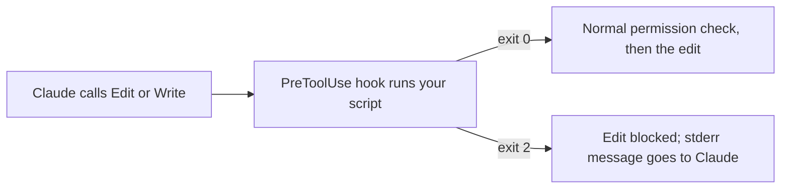

# Enforce a rule with a hook

<sub>**Intermediate** · Lesson 5 of 8 · about 20 minutes · Needs: [Permissions, settings scopes and the sandbox](#) · Verified against Claude Code v2.1.X (stable) on YYYY-MM-DD</sub>

## Goal

By the end of this lesson you can add a hook that stops Claude from editing files you protect, and prove it fires.

## You need

- Your copy of the practice template, which ships a `package-lock.json` for this demo, or one of your own repositories that has one. Keep the template copy either way: the check runs from it, with Node.js LTS.
- `jq` installed.
- macOS, Linux or WSL2.

> [!NOTE]
> On native Windows, hook commands run in Git Bash, or in PowerShell when Git Bash is missing. Use WSL2 for this lesson.

## The idea

A permission rule asks "may Claude do this?". A [hook](https://code.claude.com/docs/en/hooks-guide) is your own command that Claude Code runs at a fixed point, every time, whatever Claude decides. A `PreToolUse` hook runs before a tool call. If your command exits with code 2, the call is blocked, and what you printed to stderr goes back to Claude as the reason.



`PreToolUse` hooks run before the permission-mode check, so a block holds in every mode.

## Worked example

This is the official protected-files hook, unchanged.

1. Save it as `.claude/hooks/protect-files.sh`:

   ```bash
   #!/bin/bash
   INPUT=$(cat)
   FILE_PATH=$(echo "$INPUT" | jq -r '.tool_input.file_path // empty')
   FILE_PATH="${FILE_PATH//\\//}"

   PROTECTED_PATTERNS=(".env" "package-lock.json" ".git/")

   for pattern in "${PROTECTED_PATTERNS[@]}"; do
     if [[ "$FILE_PATH" == *"$pattern"* ]]; then
       echo "Blocked: $FILE_PATH matches protected pattern '$pattern'" >&2
       exit 2
     fi
   done
   exit 0
   ```

2. Make it executable: `chmod +x .claude/hooks/protect-files.sh`.
3. Register it in `.claude/settings.json`:

   ```json
   {
     "hooks": {
       "PreToolUse": [
         {
           "matcher": "Edit|Write",
           "hooks": [
             { "type": "command", "command": "\"$CLAUDE_PROJECT_DIR\"/.claude/hooks/protect-files.sh" }
           ]
         }
       ]
     },
     "permissions": {
       "deny": ["Read(.env)"]
     }
   }
   ```

4. From the repository root, test the script without Claude by piping in the JSON a tool call would send:

   ```bash
   echo "{\"tool_input\":{\"file_path\":\"$PWD/.env\"}}" | .claude/hooks/protect-files.sh; echo "exit $?"
   ```

   It prints the `Blocked:` line and `exit 2`.
5. In a session, run `/hooks`. The hook is listed under `PreToolUse`.
6. Ask Claude to add a blank line at the end of `package-lock.json`. The edit is blocked, and Claude reports the `Blocked:` reason.

   The `Read(.env)` deny rule keeps Claude's file tools away from any real `.env`, so the hook is never your only protection for secrets ([permissions: Read and Edit](https://code.claude.com/docs/en/permissions#read-and-edit)).

## Your turn

The example has a bug. `*".env"*` also matches `.env.example`, which teams commit on purpose, and any path that merely contains `.env`, such as `src/config.envelope.ts`. It also misses `secrets/`. Edit the script so that:

1. A file named exactly `.env`, or `.env.` followed by anything except `example`, is blocked in any folder.
2. Anything inside a `secrets/` folder is blocked.
3. Everything else is allowed.

Start from this skeleton:

```bash
NAME=$(basename "$FILE_PATH")
# TODO: block .env and .env.* except .env.example
# TODO: block any path containing /secrets/
exit 0
```

Then, in a session, ask Claude to edit `.env.example`, and then to create `secrets/test.key`.

## Check

You are done when all of these are true:

- [ ] Every input in the table below gives its expected exit code when piped to your script.
- [ ] Claude's edit to `.env.example` succeeded: `git status --porcelain` lists the file.
- [ ] Self-check (not tested): Claude's attempt to create `secrets/test.key` was blocked with your `Blocked:` message, and `/hooks` lists your hook.

Run the loop from your repository's root. Edit and Write always send an absolute `file_path` ([hooks reference](https://code.claude.com/docs/en/hooks#pretooluse-input)), so every row starts with `$PWD`. The exit code must match.

| Input `file_path` | Expected exit |
|---|---|
| `$PWD/.env` | 2 |
| `$PWD/config/.env.local` | 2 |
| `$PWD/.env.example` | 0 |
| `$PWD/secrets/api.key` | 2 |
| `$PWD/src/config.envelope.ts` | 0 |

```bash
for p in "$PWD/.env" "$PWD/config/.env.local" "$PWD/.env.example" "$PWD/secrets/api.key" "$PWD/src/config.envelope.ts"; do
  printf '%s ' "$p"; echo "{\"tool_input\":{\"file_path\":\"$p\"}}" | .claude/hooks/protect-files.sh 2>/dev/null; echo $?
done
```

Run `npm run check -- i-5 --dir <your repo>` from your template copy (or `npm run check -- i-5` inside the template).

## Watch out

- This hook watches the Edit and Write tools only. A shell command such as `echo X >> .env` goes through Bash, and this script cannot see its target: Bash input has `command`, not `file_path`. Add an `Edit(.env)` deny rule as well: it also covers shell redirects like `>> .env` ([permissions: Redirections](https://code.claude.com/docs/en/permissions#redirections)). The [hooks guide](https://code.claude.com/docs/en/hooks-guide#filter-hooks-with-matchers) shows a `Bash|PowerShell` pattern for full coverage.
- Hooks in a repository's `.claude/settings.json` run in an interactive session once you trust the folder, and in `claude -p` or SDK runs without asking. Read a repository's hooks before you trust it or script `claude -p` in it.

## Go further

- Official: [Automate actions with hooks](https://code.claude.com/docs/en/hooks-guide) and the [hooks reference](https://code.claude.com/docs/en/hooks).

---

<sub>Sources: [Automate actions with hooks](https://code.claude.com/docs/en/hooks-guide) · [Hooks reference: workspace trust](https://code.claude.com/docs/en/hooks#workspace-trust) · [Configure permissions](https://code.claude.com/docs/en/permissions)</sub>

<sub>← [Permissions, settings scopes and the sandbox](#) · [Intermediate index](#) · [Delegate to a custom subagent](#) → · Topic: [Hooks](../topics/hooks.md) · [Stuck on this lesson?](https://github.com/wesammustafa/Claude-Code-Everything-You-Need-to-Know/issues/new?template=lesson-feedback.yml&lesson=i-5)</sub>
