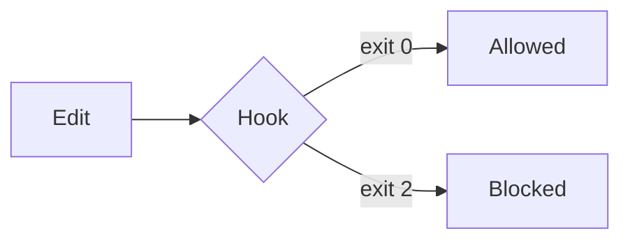

# Keep a session on track

A hook exits 0 to allow the edit or 2 to block it.

```mermaid
flowchart LR
  accTitle: Hook exit paths
  accDescr: An edit reaches the hook; exit 0 allows it and exit 2 blocks it.
  A[Edit] --> B{Hook}
  B -->|exit 0| C[Allowed]
  B -->|exit 2| D[Blocked]
```
