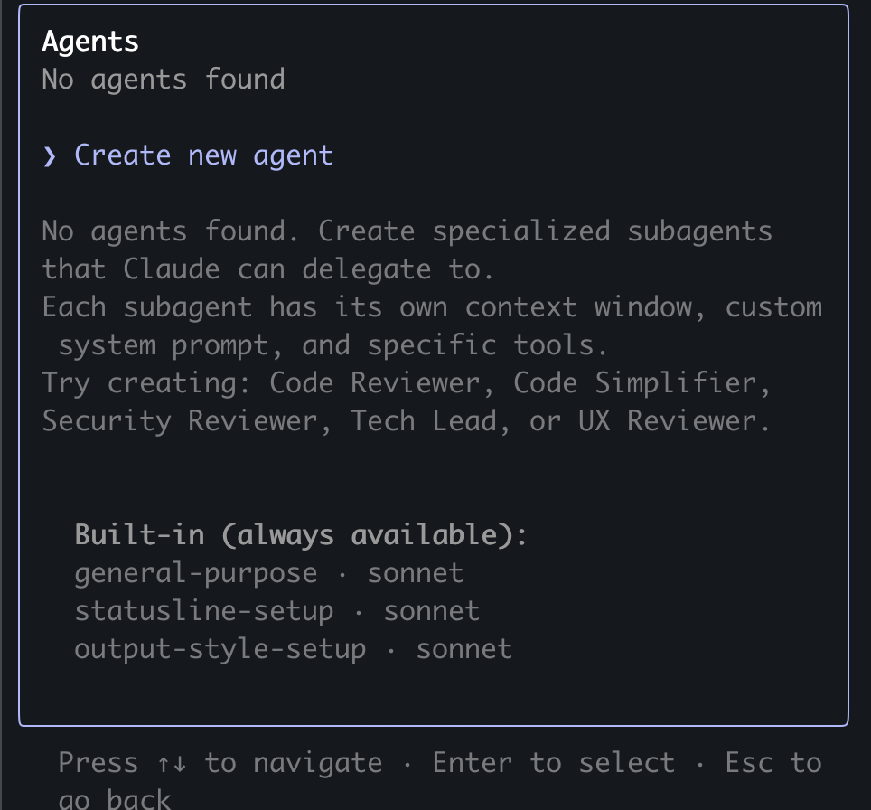
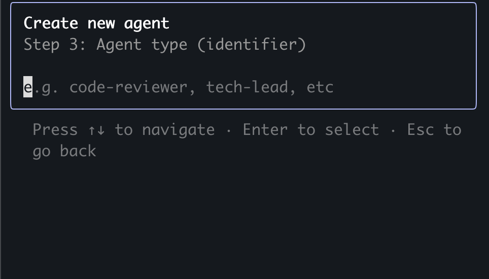
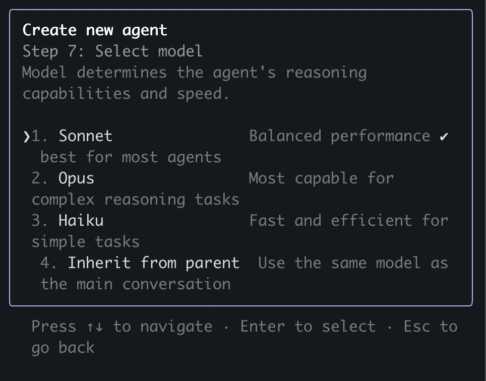

# Claude-Code-Everything-You-Need-to-Know
The ultimate all-in-one guide to mastering Claude Code. From setup, prompt engineering, commands, hooks, workflows, automation, and integrations, to MCP servers, tools, and the BMAD method—packed with step-by-step tutorials, real-world examples, and expert strategies to make this the global go-to repo for Claude mastery.

> **⚠️ IMPORTANT NOTE**  
> To get the best visualization for the documents in this repo, please install [Obsidian](https://obsidian.md/).


### 🧵 What We Covered:

- What are LLMs, and how do they differ from AI tools like Claude Code? Why should we use AI tools?
- What is Claude Code?
- Claude Code Setup: Get up and running seamlessly with a clean, optimized installation.
- Prompt Engineering Deep Dive
- Claude Commands Mastery: Extract the best possible results by leveraging Claude's command capabilities to their fullest.
- AI Agents: Harness agents, sub-agents, and `worktrees` to structure intelligence with precision.

🚀 What We'll Cover Next:

- Step-by-Step Live Demo: Creating Specialized AI Agents
- Hooks That Work: Discover the power of Claude Hooks and learn how to implement them for maximum impact.
- What are MCP servers and how to use them?
- Workflow Design: Build fully customized, high-performance workflows tailored to your project goals.
- Software Development Life Cycle (SDLC)
- Super Claude: Unlock advanced capabilities and push beyond standard limits.
- The BMAD Method: Apply a proven, systematic approach to deliver consistent, high-quality outcomes.
- Hands-On Demo: Full App Development Through the SDLC, Step by Step!

### What are LLMs, and how do they differ from AI tools like Claude Code?

**LLM (Large Language Model):**
- This is the underlying AI technology/engine
- Think of it like a car engine - it's the core component that makes everything work
- Examples: GPT-4, Claude 4, Gemini (the actual AI models)

**Products built with LLMs:** These are the applications and tools that use LLMs to provide specific services:

**Claude Code:**
- A command-line tool that uses Claude's LLM
- Specifically designed for developers to code from their terminal
- It's like putting the Claude engine into a developer-focused interface

**ChatGPT:**
- A web/app interface that uses GPT models
- Designed for general conversations and tasks

**Google Bard/Gemini:**
- Google's chat interface that uses their Gemini LLM
- Note: "Gemini" refers both to Google's LLM and their chat product

**Analogy:**
- **LLM** = Car engine
- **Claude Code** = A pickup truck (built for specific work)
- **ChatGPT** = A family sedan (built for general use)
- **Google Bard** = A racing car
The LLM is the "brain" that understands and generates language, while products like Claude Code are specialized interfaces that make that brain accessible for particular use cases.
---
### What is Claude Code?
Claude Code is a command-line tool that lets developers work with Claude directly from their terminal or command prompt. Think of it as having an AI coding assistant that lives right in your development environment.

Here's what makes it useful in simple terms:

**What it does:**

- You can ask Claude to write code, fix bugs, or explain programming concepts without leaving your terminal
- It can read and work with files in your project directory
- You can delegate entire coding tasks to Claude and it will work through them step-by-step

**Why developers like it:**

- No need to copy-paste code back and forth between a web browser and your code editor
- Claude can see your actual project files and understand the context of what you're working on
- It fits naturally into existing development workflows
- You can automate repetitive coding tasks

**Example use cases:**

- "Claude, add error handling to this function"
- "Write unit tests for my new feature"
- "Help me refactor this messy code"
- "Explain what this legacy code does"
It's essentially like having a very pair programming partner who can jump in and help with coding tasks whenever you need it.
---
### Claude Code Setup

[](https://www.anthropic.com/claude-code)

[](https://docs.anthropic.com/en/docs/claude-code/overview)

---
### Prompt Engineering Deep Dive
> [!quote] Claude Initialization
> Run the `/init` command to automatically generate a `CLAUDE.md` file.
> Your `CLAUDE.md` files become part of Claude's prompts, so they should be refined like any frequently used prompt. A common mistake is adding extensive content without iterating on its effectiveness. Take time to experiment and determine what produces the best instruction following from the model.
##### 1. Explore → Plan → Code → Commit
> Versatile workflow for complex problems.

- **Explore:** Read relevant files/images/URLs; use subagents for verification. Do **not code yet**.  
- **Plan:** Ask Claude to make a plan. Use `"think"`, `"think hard"`, `"think harder"`, or `"ultrathink"` to increase computation time. Optionally save plan for future reference.  
- **Code:** Implement the solution; verify reasonableness as you go.  
- **Commit:** Commit results, create pull requests, update READMEs/changelogs.
- Claude has two default modes: `Plan Mode` and `Accept Edits Mode`. You can toggle between them using the `Shift + Tab` keys.
    - 
    - 

    
> [!warning] Research & planning first improves performance for complex tasks.
---

##### 2. Test-Driven Workflow (Write Tests → Code → Commit)
> Ideal for changes verifiable with unit/integration tests.

- **Write Tests:** Create tests based on expected inputs/outputs; mark as TDD.  
- **Run & Fail Tests:** Confirm they fail; no implementation yet.  
- **Commit Tests:** Commit once satisfied.  
- **Write Code:** Implement code to pass tests; iterate with verification via subagents.  
- **Commit Code:** Final commit after all tests pass.

> 🔹 Clear targets (tests, mocks) improve iteration efficiency.

---
##### 3. Visual Iteration (Code → Screenshot → Iterate → Commit)
- Provide screenshots or visual mocks.  
- Implement code, take screenshots, iterate until outputs match mock.  
- Commit once satisfied.

> 🔹 Iteration significantly improves output quality (2-3 rounds usually enough).
### Claude Commands
##### Built-in slash commands

| Command                   | Purpose                                                                                                  |
| ------------------------- | -------------------------------------------------------------------------------------------------------- |
| `/add-dir`                | Add additional working directories                                                                       |
| `/agents`                 | Manage custom AI subagents for specialized tasks                                                         |
| `/bug`                    | Report bugs (sends conversation to Anthropic)                                                            |
| `/clear`                  | Clear conversation history                                                                               |
| `/compact [instructions]` | Compact conversation with optional focus instructions                                                    |
| `/config`                 | View/modify configuration                                                                                |
| `/cost`                   | Show token usage statistics                                                                              |
| `/doctor`                 | Checks the health of your Claude Code installation                                                       |
| `/help`                   | Get usage help                                                                                           |
| `/init`                   | Initialize project with CLAUDE.md guide                                                                  |
| `/login`                  | Switch Anthropic accounts                                                                                |
| `/logout`                 | Sign out from your Anthropic account                                                                     |
| `/mcp`                    | Manage MCP server connections and OAuth authentication                                                   |
| `/memory`                 | Edit CLAUDE.md memory files                                                                              |
| `/model`                  | Select or change the AI model                                                                            |
| `/permissions`            | View or update [permissions](https://docs.anthropic.com/en/docs/claude-code/iam#configuring-permissions) |
| `/pr_comments`            | View pull request comments                                                                               |
| `/review`                 | Request code review                                                                                      |
| `/status`                 | View account and system statuses                                                                         |
| `/terminal-setup`         | Install Shift+Enter key binding for newlines (iTerm2 and VSCode only)                                    |
| `/vim`                    | Enter vim mode for alternating insert and command modes                                                  |

##### Custom slash commands
>[!quote] Custom slash commands allow you to define frequently-used prompts as Markdown files that Claude Code can execute. Commands are organized by scope (project-specific or personal) and support namespacing through directory structures.

```Bash
mkdir -p .claude/commands
echo "Analyze this code for performance issues and suggest optimizations:" > .claude/commands/optimize.md
```

**Example**
- Create new file named `pull-request.md` in `.claude/commands`
- Add the following info to file
    ```markdown
    # Create Pull Request Command
    
    Create a new branch, commit changes, and submit a pull request.
    
    ## Behavior
    - Creates a new branch based on current changes
    - Formats modified files using Biome
    - Analyzes changes and automatically splits into logical commits when appropriate
    - Each commit focuses on a single logical change or feature
    - Creates descriptive commit messages for each logical unit
    - Pushes branch to remote
    - Creates pull request with proper summary and test plan
    
    ## Guidelines for Automatic Commit Splitting
    - Split commits by feature, component, or concern
    - Keep related file changes together in the same commit
    - Separate refactoring from feature additions
    - Ensure each commit can be understood independently
    - Multiple unrelated changes should be split into separate commits
    ```
### AI Agents

[**Git worktree**](https://git-scm.com/docs/git-worktree)

> [!quote]	Worktrees allow multiple copies of the same Git repository on your local environemt, each on a different branch.

- **Single repo limitation:** Normally, a Git repository can only be on one branch in one folder.  
- **Worktrees:** Enable working on multiple branches simultaneously in separate folders.  
- **Isolation:** Changes in one worktree do **not** interfere with others.
    **Example**
    - **Main repo folder:** branch `main`  
    - **Worktree folder:** branch `feature-x`  
    - You can edit both simultaneously without switching branches.

1. **Create worktrees**
    - `git worktree add -b feature-a ../feature-a`
    - Create additional worktrees as needed (repeat steps 1 in new terminal tabs)
    - Ex: Three separate terminal tabs, each linked to its own branch and worktree
    
2. **Launch Claude in each worktree**
    - `cd ../feature-a && claude`
    -  Ex: three Claude code sessions to manage each branch
    

3. **General Agents**
   > [!quote] Claude Code's **agent system** — a powerful feature that lets you create specialized AI assistants for different coding tasks. Think of agents as specialized team members, each with their own expertise, tools, and focus area. Instead of having one general-purpose Claude handle everything, you can create focused agents for specific roles.
   
   - Example: Each agent can span multiple sub-agents to accelerate the process:  
     ```markdown
     - Analyze the implementation of the payment feature
     - Span 5 subagents to accelerate work
     - Ultrathink
     ```
     

   - Subagents executing multiple tasks in parallel, coordinated through a to-do list:  
     
4. **Specialized Agents**
    -  **Traditional approach:**
        - One Claude tries to be everything
        - Generic feedback covering all areas
        - Context gets mixed between different types of reviews
        
    -  **Agent approach:**
        - Specialized expertise for each task
        - Focused, deep feedback in specific areas
        - Clean separation of concerns
        - Each agent "remembers" previous conversations in their domain
    
    - Let's do it, step by step

     [Open full Canvas](Agent%20Creation%20Workflow.canvas)
    

    
    
    
    
    
    

    [Security Reviewer Prompt](Specialized%20Agents/System%20Prompts/Security%20Reviewer%20Prompt.md)

    
    
    [Security Reviewer Description](Specialized%20Agents/Descriptions/Security%20Reviewer%20Description.md)

    
    
    
    
    
    
    
    
    
    

5. **General Agent orchestrate collaboration between Specialized Agents**
    ```md
    Get the **backend-engineer** to suggest changes for improving the UI of our app. Then, get the **backend-engineer** to implement those changes. Then, get the **code-reviewer** to review the changes made by the **backend-engineer**. Finally, get the **backend-engineer** to fix up any issues pointed out by the reviewer.
    ```


> [!tip]
> - Use consistent naming conventions for worktrees
> - Maintain one terminal tab per worktree
> - Use [`Tmux`](https://github.com/tmux/tmux/wiki/Installing) to create a session for each terminal, allowing you to **detach** and keep processes running in the background.process working in background
> - Use separate IDE windows for different worktrees
> - Clean up when finished: `git worktree remove ../feature-a
### References
- https://github.com/adrianhajdin/ecommerce_sanity_stripe
- https://docs.anthropic.com/en/docs/claude-code/quickstart
- https://www.anthropic.com/engineering/claude-code-best-practices
- https://docs.anthropic.com/en/docs/claude-code/slash-commands
- https://aws.amazon.com/what-is/sdlc/
- https://www.anthropic.com/engineering/building-effective-agents
- https://www.anthropic.com/news/how-anthropic-teams-use-claude-code
- https://modelcontextprotocol.io/docs/getting-started/intro
- https://github.com/yamadashy/repomix
- https://tmuxcheatsheet.com/
- https://obsidian.md/