# Claude-Code-Everything-You-Need-to-Know
The ultimate all-in-one guide to mastering Claude Code. From setup, prompt engineering, commands, hooks, workflows, automation, and integrations, to MCP servers, tools, and the BMAD method—packed with step-by-step tutorials, real-world examples, and expert strategies to make this the global go-to repo for Claude mastery.

> **⚠️ IMPORTANT NOTE**  
> To get the best visualization for the documents in this repo, please install [Obsidian](https://obsidian.md/).

### 🧵 What We Covered:

- What are LLMs, and how do they differ from AI tools like Claude Code? Why should we use AI tools?
- What is Claude Code?
- Claude Code Setup: Get up and running seamlessly with a clean, optimized installation.
- Prompt Engineering Deep Dive
- Claude Commands Mastery: Extract the best possible results by leveraging Claude's command capabilities to their fullest.
- AI Agents: Harness agents, sub-agents, and `worktrees` to structure intelligence with precision.
- Hooks That Work: Discover the power of Claude Hooks and learn how to implement them for maximum impact.
- What are MCP servers and how to use them?
- Software Development Life Cycle (SDLC)
- Workflow Design: Build fully customized, high-performance workflows tailored to your project goals.
- Hands-On Demo: Full App Development Through the SDLC, Step by Step!
- Super Claude: Unlock advanced capabilities and push beyond standard limits.
- The BMAD Method: Apply a proven, systematic approach to deliver consistent, high-quality outcomes.

### What are LLMs, and how do they differ from AI tools like Claude Code?

**LLM (Large Language Model):**
- This is the underlying AI technology/engine
- Think of it like a car engine - it's the core component that makes everything work
- Examples: GPT-4, Claude 4, Gemini (the actual AI models)

**Products built with LLMs:** These are the applications and tools that use LLMs to provide specific services:

**Claude Code:**
- A command-line tool that uses Claude's LLM
- Specifically designed for developers to code from their terminal
- It's like putting the Claude engine into a developer-focused interface

**ChatGPT:**
- A web/app interface that uses GPT models
- Designed for general conversations and tasks

**Google Bard/Gemini:**
- Google's chat interface that uses their Gemini LLM
- Note: "Gemini" refers both to Google's LLM and their chat product

**Analogy:**
- **LLM** = Car engine
- **Claude Code** = A pickup truck (built for specific work)
- **ChatGPT** = A family sedan (built for general use)
- **Google Bard** = A racing car
The LLM is the "brain" that understands and generates language, while products like Claude Code are specialized interfaces that make that brain accessible for particular use cases.
---
### What is Claude Code?
Claude Code is a command-line tool that lets developers work with Claude directly from their terminal or command prompt. Think of it as having an AI coding assistant that lives right in your development environment.

Here's what makes it useful in simple terms:

**What it does:**

- You can ask Claude to write code, fix bugs, or explain programming concepts without leaving your terminal
- It can read and work with files in your project directory
- You can delegate entire coding tasks to Claude and it will work through them step-by-step

**Why developers like it:**

- No need to copy-paste code back and forth between a web browser and your code editor
- Claude can see your actual project files and understand the context of what you're working on
- It fits naturally into existing development workflows
- You can automate repetitive coding tasks

**Example use cases:**

- "Claude, add error handling to this function"
- "Write unit tests for my new feature"
- "Help me refactor this messy code"
- "Explain what this legacy code does"
It's essentially like having a very pair programming partner who can jump in and help with coding tasks whenever you need it.
---
### Claude Code Setup

[](https://www.anthropic.com)

[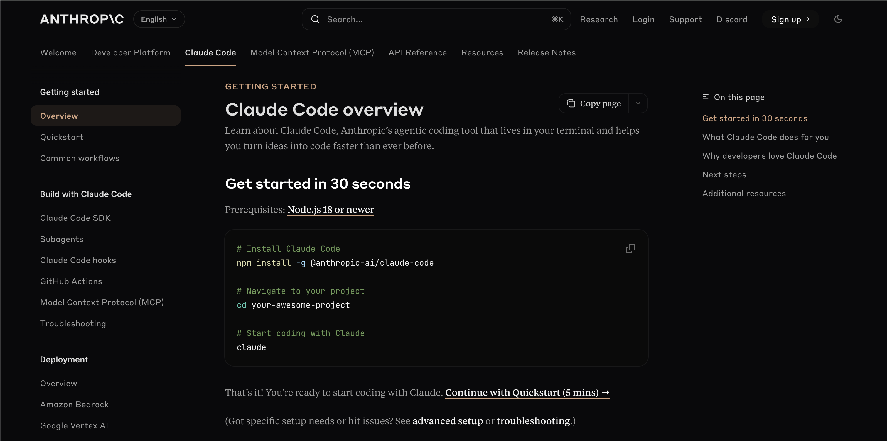](https://docs.anthropic.com/en/docs/claude-code/overview)

---
### Prompt Engineering Deep Dive
> **📖 Claude Initialization**
> Run the `/init` command to automatically generate a `CLAUDE.md` file.
> Your `CLAUDE.md` files become part of Claude's prompts, so they should be refined like any frequently used prompt. A common mistake is adding extensive content without iterating on its effectiveness. Take time to experiment and determine what produces the best instruction following from the model.
#### 1. Explore → Plan → Code → Commit
> Versatile workflow for complex problems.

- **Explore:** Read relevant files/images/URLs; use subagents for verification. Do **not code yet**.  
- **Plan:** Ask Claude to make a plan. Use `"think"`, `"think hard"`, `"think harder"`, or `"ultrathink"` to increase computation time. Optionally save plan for future reference.  
- **Code:** Implement the solution; verify reasonableness as you go.  
- **Commit:** Commit results, create pull requests, update READMEs/changelogs.
- Claude has two default modes: `Plan Mode` and `Accept Edits Mode`. You can toggle between them using the `Shift + Tab` keys.
    - 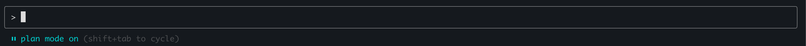
    - 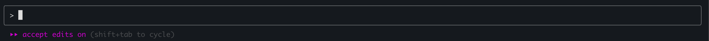

> **⚠️ Warning:** Research & planning first improves performance for complex tasks.

---

#### 2. Test-Driven Workflow (Write Tests → Code → Commit)
> Ideal for changes verifiable with unit/integration tests.

- **Write Tests:** Create tests based on expected inputs/outputs; mark as TDD.  
- **Run & Fail Tests:** Confirm they fail; no implementation yet.  
- **Commit Tests:** Commit once satisfied.  
- **Write Code:** Implement code to pass tests; iterate with verification via subagents.  
- **Commit Code:** Final commit after all tests pass.

> 🔹 Clear targets (tests, mocks) improve iteration efficiency.

---
#### 3. Visual Iteration (Code → Screenshot → Iterate → Commit)
- Provide screenshots or visual mocks.  
- Implement code, take screenshots, iterate until outputs match mock.  
- Commit once satisfied.

> 🔹 Iteration significantly improves output quality (2-3 rounds usually enough).

---

### Claude Commands
#### Built-in slash commands

| Command                   | Purpose                                                                                                  |
| ------------------------- | -------------------------------------------------------------------------------------------------------- |
| `/add-dir`                | Add additional working directories                                                                       |
| `/agents`                 | Manage custom AI subagents for specialized tasks                                                         |
| `/bug`                    | Report bugs (sends conversation to Anthropic)                                                            |
| `/clear`                  | Clear conversation history                                                                               |
| `/compact [instructions]` | Compact conversation with optional focus instructions                                                    |
| `/config`                 | View/modify configuration                                                                                |
| `/cost`                   | Show token usage statistics                                                                              |
| `/doctor`                 | Checks the health of your Claude Code installation                                                       |
| `/help`                   | Get usage help                                                                                           |
| `/init`                   | Initialize project with CLAUDE.md guide                                                                  |
| `/login`                  | Switch Anthropic accounts                                                                                |
| `/logout`                 | Sign out from your Anthropic account                                                                     |
| `/mcp`                    | Manage MCP server connections and OAuth authentication                                                   |
| `/memory`                 | Edit CLAUDE.md memory files                                                                              |
| `/model`                  | Select or change the AI model                                                                            |
| `/permissions`            | View or update [permissions](https://docs.anthropic.com/en/docs/claude-code/iam#configuring-permissions) |
| `/pr_comments`            | View pull request comments                                                                               |
| `/review`                 | Request code review                                                                                      |
| `/status`                 | View account and system statuses                                                                         |
| `/terminal-setup`         | Install Shift+Enter key binding for newlines (iTerm2 and VSCode only)                                    |
| `/vim`                    | Enter vim mode for alternating insert and command modes                                                  |

#### Custom slash commands
> **📖 Note:** Custom slash commands allow you to define frequently-used prompts as Markdown files that Claude Code can execute. Commands are organized by scope (project-specific or personal) and support namespacing through directory structures.

```bash
mkdir -p .claude/commands
echo "Analyze this code for performance issues and suggest optimizations:" > .claude/commands/optimize.md
```

**Example**
- Create new file named `pull-request.md` in `.claude/commands`
- Add the following info to file
    ```markdown
    # Create Pull Request Command
    
    Create a new branch, commit changes, and submit a pull request.
    
    ## Behavior
    - Creates a new branch based on current changes
    - Formats modified files using Biome
    - Analyzes changes and automatically splits into logical commits when appropriate
    - Each commit focuses on a single logical change or feature
    - Creates descriptive commit messages for each logical unit
    - Pushes branch to remote
    - Creates pull request with proper summary and test plan
    
    ## Guidelines for Automatic Commit Splitting
    - Split commits by feature, component, or concern
    - Keep related file changes together in the same commit
    - Separate refactoring from feature additions
    - Ensure each commit can be understood independently
    - Multiple unrelated changes should be split into separate commits
    ```
### AI Agents

[**Git worktree**](https://git-scm.com/docs/git-worktree)

> **📖 Git Worktree:** Worktrees allow multiple copies of the same Git repository on your local environment, each on a different branch.

- **Single repo limitation:** Normally, a Git repository can only be on one branch in one folder.  
- **Worktrees:** Enable working on multiple branches simultaneously in separate folders.  
- **Isolation:** Changes in one worktree do **not** interfere with others.
    **Example**
    - **Main repo folder:** branch `main`  
    - **Worktree folder:** branch `feature-x`  
    - You can edit both simultaneously without switching branches.

1. **Create worktrees**
    - `git worktree add -b feature-a ../feature-a`
    - Create additional worktrees as needed (repeat steps 1 in new terminal tabs)
    - Ex: Three separate terminal tabs, each linked to its own branch and worktree
    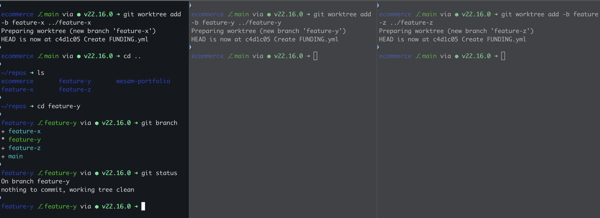
2. **Launch Claude in each worktree**
    - `cd ../feature-a && claude`
    -  Ex: three Claude code sessions to manage each branch
    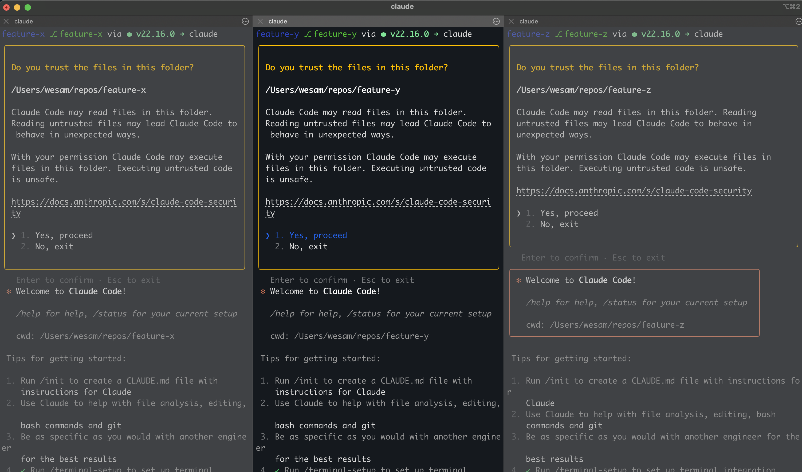

3. **General Agents**
   > **📖 Agent System:** Claude Code's **agent system** — a powerful feature that lets you create specialized AI assistants for different coding tasks. Think of agents as specialized team members, each with their own expertise, tools, and focus area. Instead of having one general-purpose Claude handle everything, you can create focused agents for specific roles.
   
   - Example: Each agent can span multiple sub-agents to accelerate the process:  
     ```markdown
     - Analyze the implementation of the payment feature
     - Span 5 subagents to accelerate work
     - Ultrathink
     ```
     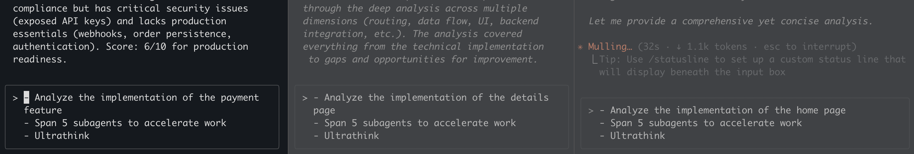

   - Subagents executing multiple tasks in parallel, coordinated through a to-do list:  
     

4. **Specialized Agents**
    -  **Traditional approach:**
        - One Claude tries to be everything
        - Generic feedback covering all areas
        - Context gets mixed between different types of reviews
        
    -  **Agent approach:**
        - Specialized expertise for each task
        - Focused, deep feedback in specific areas
        - Clean separation of concerns
        - Each agent "remembers" previous conversations in their domain
    
    - Let's do it, step by step

    [View Agent Creation Workflow](Images/agent-creation-workflow.png)
    

    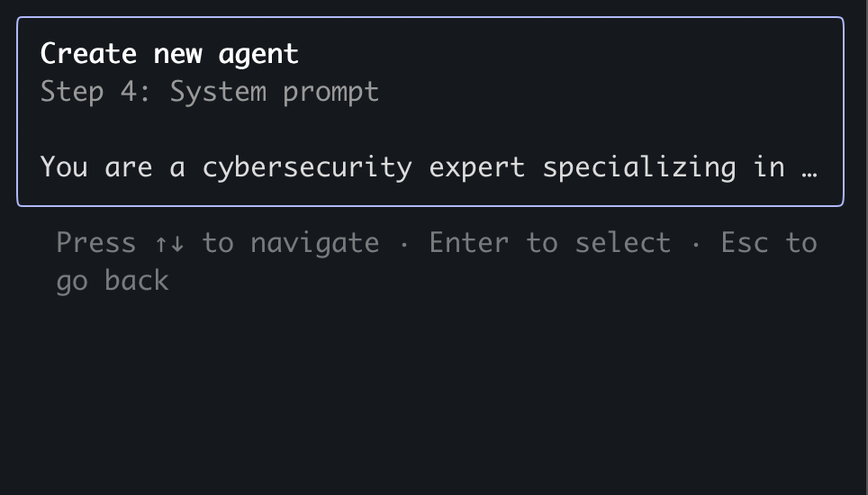

    [Security Reviewer Prompt](specialized-agents/system-prompts/security-reviewer-prompt.md)

    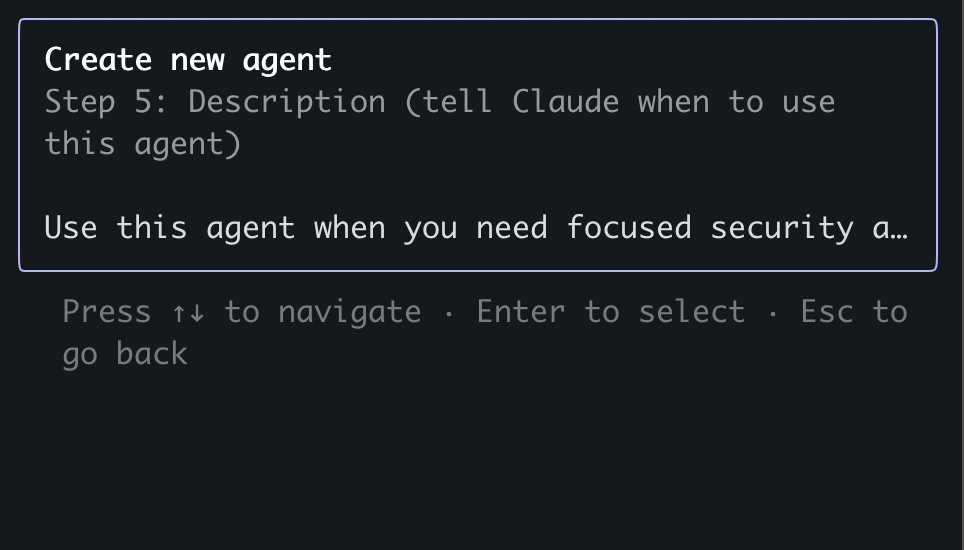
    
    [Security Reviewer Description](specialized-agents/descriptions/security-reviewer-description.md)

5. **General Agent orchestrate collaboration between Specialized Agents**
    ```md
    Get the **backend-engineer** to suggest changes for improving the UI of our app. Then, get the **backend-engineer** to implement those changes. Then, get the **code-reviewer** to review the changes made by the **backend-engineer**. Finally, get the **backend-engineer** to fix up any issues pointed out by the reviewer.
    ```
    

> **💡 Tip:**
> - Use consistent naming conventions for worktrees
> - Maintain one terminal tab per worktree
> - Use [`Tmux`](https://github.com/tmux/tmux/wiki/Installing) to create a session for each terminal, allowing you to **detach** and keep processes running in the background
> - Use separate IDE windows for different worktrees
> - Clean up when finished: `git worktree remove ../feature-a`

### Hooks

Claude Code hooks are customizable checkpoints that let you intercept and control Claude's autonomous coding operations before they execute on your system. They act as programmable guardrails where you can define safety policies, validate changes, require approvals, or log activities. When Claude attempts to modify files, run commands, or make system changes, your hooks can inspect the proposed action and either allow it, block it, or modify it based on your custom logic, giving you fine-grained control over what the AI agent can actually do to your codebase.

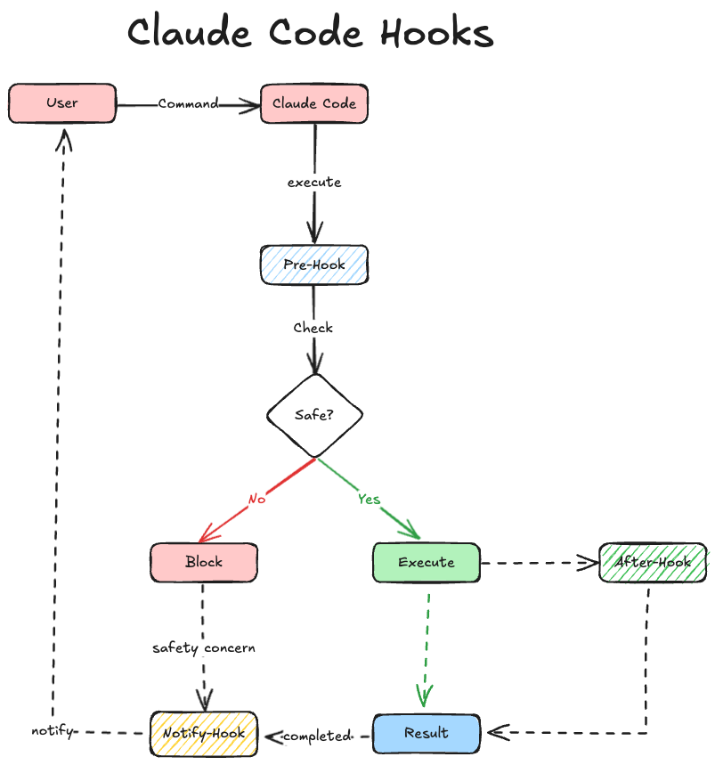

### Setting Up Claude Hooks

Claude Code hooks are configured in **settings files** such as `~/.claude/settings.json` (user settings), `.claude/settings.json` (project settings), `.claude/settings.local.json` (local project settings), and enterprise managed policy settings.

Follow these steps to configure hooks in your project:

1. **Copy Hooks Folder**  
   Copy the `.claude/hooks` directory into the `.claude` folder at the root of your project.

2. **Review Available Hooks**  
   Inside the `hooks` folder, you’ll find Python scripts for each hook (e.g., `notification`, `post_tool_use`, etc.).

3. **Keep Only Required Hooks**  
   Retain the hooks you need and delete the rest.

4. **Install Package Manager**  
   Install the [uv](https://docs.astral.sh/uv/getting-started/installation/) Python package manager.  
   > This is required to execute Python scripts.

5. **Copy Settings File**  
   Copy `.claude/settings.json` into your `.claude` folder.

6. **Update Settings Path**  
   Open `settings.json`, find the entry for: "/Users/wesam/.local/bin/uv" Replace it with the actual path returned by:  
 ```bash which uv```

```text
project-root/
│
├── .claude/
│   ├── hooks/
│   │   ├── notification.py
│   │   ├── post_tool_use.py
│   │   └── ... (other hooks you keep)
│   │
│   └── settings.json
│
└── (other project files)
```

For a complete working example of hooks in action, see the [Event-X repository](https://github.com/wesammustafa/Event-X).

### Hook Events

Hooks run in response to various events within Claude Code's lifecycle:
[examples](https://github.com/disler/claude-code-hooks-mastery)
- **`PreToolUse`**: Runs **after Claude creates tool parameters but before processing the tool call**.
- **`PostToolUse`**: Runs **immediately after a tool completes successfully**.
- **`Notification`**: Runs when Claude Code sends notifications, such as when permission is needed to use a tool or when prompt input has been idle.
- **`UserPromptSubmit`**: Runs when the user submits a prompt, **before Claude processes it**.
- **`Stop`**: Runs when the main Claude Code agent has finished responding (does not run if stopped by user interrupt).
- **`SubagentStop`**: Runs when a Claude Code subagent (Task tool call) has finished responding.
- **`SessionEnd`**: Runs when a Claude Code session ends.
- **`PreCompact`**: Runs before Claude Code is about to run a compact operation.
- **`SessionStart`**: Runs when Claude Code starts a new session or resumes an existing session.

### Hook Input

Hooks receive **JSON data via stdin** containing session information and event-specific data. Common fields include `session_id`, `transcript_path` (path to conversation JSON), and `cwd` (current working directory). Event-specific fields vary:

| Hook Event           | Payload / Fields |
|---------------------|-----------------|
| `PreToolUse`         | `tool_name`, `tool_input` |
| `PostToolUse`        | `tool_name`, `tool_input`, `tool_response` |
| `Notification`       | `message` |
| `UserPromptSubmit`   | `prompt` |
| `Stop` / `SubagentStop` | `stop_hook_active` |
| `PreCompact`         | `trigger`, `custom_instructions` |
| `SessionStart`       | `source` |
| `SessionEnd`         | `reason` |


### Hook Output

Hooks communicate status and control Claude Code behavior in two ways:

## Hook Exit Codes and JSON Output

| Exit Code / Feature                     | Behavior / Description |
|----------------------------------------|-----------------------|
| **Exit code 0 (Success)**               | `stdout` is shown to the user in transcript mode (CTRL-R). For `UserPromptSubmit` and `SessionStart`, `stdout` is added to Claude's context. |
| **Exit code 2 (Blocking error)**        | `stderr` is fed back to Claude or shown to the user to block actions depending on the hook event. Examples: **blocks tool calls in `PreToolUse`** and **prompt processing in `UserPromptSubmit`**. |
| **Other exit codes (Non-blocking error)** | `stderr` is shown to the user, but execution continues. |
| **Advanced: JSON Output**               | Hooks can return structured JSON in `stdout` for sophisticated control. |
| `PreToolUse`                            | `permissionDecision`: `"allow"`, `"deny"`, or `"ask"`. |
| `PostToolUse`                           | `decision`: `"block"` or `undefined`; `additionalContext` can be returned. |
| `UserPromptSubmit`                       | `decision`: `"block"` or `undefined`; `additionalContext` can be returned. |
| `Stop` / `SubagentStop`                 | `decision`: `"block"` or `undefined`. |
| `SessionStart`                           | `additionalContext` can be added. |


### Security Considerations

Hooks execute **arbitrary shell commands** on your system automatically and can modify, delete, or access any files your user account can access. Users are solely responsible for configured commands, and Anthropic provides no warranty.

**Security Best Practices** include:

- Validating and sanitizing inputs.
- Quoting shell variables.
- Blocking path traversal.
- Using absolute paths for scripts.
- Skipping sensitive files (e.g., `.env`, `.git/`). Configuration safety features include capturing a snapshot of hooks at startup and warning if hooks are modified externally, requiring review to apply changes.

### Hook Execution Details and Debugging

- **Timeout**: Hooks have a 60-second execution limit by default, configurable per command.
- **Parallelization**: All matching hooks run in parallel.
- **Environment**: Hooks run in the current directory with Claude Code’s environment, and the `CLAUDE_PROJECT_DIR` environment variable is available.
- **Debugging**: Basic troubleshooting involves checking configuration with `/hooks`, verifying syntax, testing commands manually, and reviewing logs using `claude --debug`. Advanced debugging includes inspecting hook execution details, validating JSON schemas, and monitoring system resources.

### Model Context Protocol (MCP)

> **📚 Comprehensive MCP Documentation**
> For detailed setup, configuration, and usage of MCP servers:
> - **[MCP Servers Documentation](./mcp-servers/)** - Complete guide with prerequisites, installation, and individual server documentation (Serena, Sequential Thinking, Memory, Playwright)
> - **[Troubleshooting Guide](./mcp-servers/README.md#troubleshooting)** - Common issues and solutions

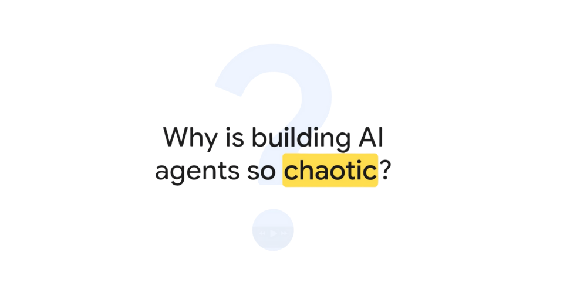

#### The Core Problem: Fragmentation and Inefficiency
- AI agents are becoming smarter but face a massive hidden communication problem that's holding them back from their full potential.
- Building AI agents is chaotic because it's ridiculously hard to get them to talk to the tools and data they need to be useful.
- The current system is described as "a complete and utter mess," referred to by Anthropic as **"the land before MCP"**.
- **Total fragmentation exists**, with teams, even inside the same company, reinventing the wheel by building custom one-off connections for every single tool and data source.
- This chaos is named the **N by M problem**:
	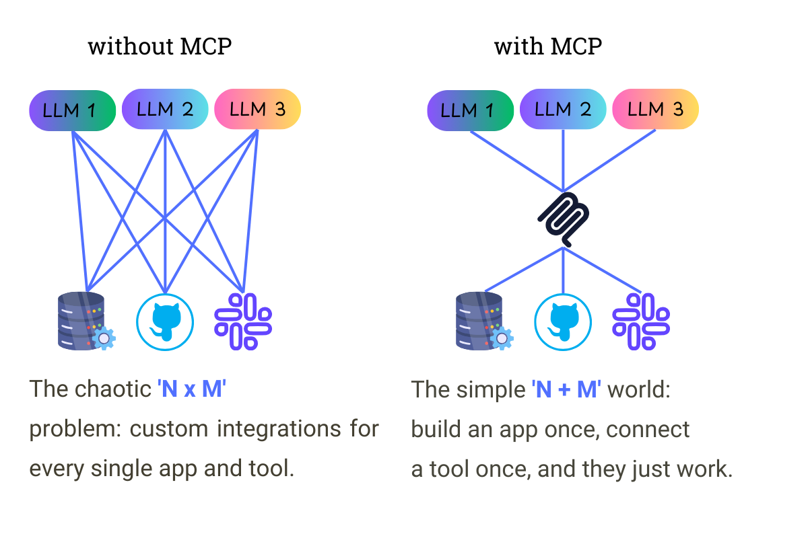
	- If you have `n` AI applications and `m` different tools, the old way forces you to build n * m unique integrations.
	- This leads to an **exponential explosion of work that is completely unsustainable**.
	 - This fragmentation everywhere, happening between different teams inside their own company, creating massive inefficiency and wasted effort.
	- The desired outcome is an **N + M world**, where you just build one connection for each app and one for each tool, and they all work together.

> **Installing Playwright MCP for Claude Code (CLI)**
Claude Code uses a different installation method than Claude Desktop, with MCP servers being added per-directory and persisting in a ~/.claude.json configuration file.

  **Quick Installation**

The simplest method for Claude Code CLI:
```bash
# Navigate to your project directory
cd /path/to/your/project

# Add Playwright MCP to Claude Code
claude mcp add playwright npx '@playwright/mcp@latest'
```

**ExecuteAutomation Version (More Features)**

```bash
claude mcp add playwright npx '@executeautomation/playwright-mcp-server'
```

**Usage After Installation**
```bash
# Start Claude Code in your project directory
claude

# Now you can use Playwright through natural language
"Use playwright mcp to open a browser to example.com"
"Take a screenshot of the current page"
"Click on the login button and fill the form"
```


**Verification Commands**

```bash
# Check available MCP tools
/mcp

# Navigate to playwright section to see all tools
# Available tools include: browser_navigate, browser_click, 
# browser_screenshot, browser_type, etc.
```


**Directory-Specific Persistence**
The claude mcp add command will persist but will only affect the directory in which you run it, with configuration stored in ~/.claude.json under a "projects" key.

```bash
# Each directory can have different MCP configurations
cd ~/project-a
claude mcp add playwright npx '@playwright/mcp@latest'

cd ~/project-b  
claude mcp add playwright npx '@executeautomation/playwright-mcp-server'
```

#### The Solution: Model Context Protocol

- **MCP is the proposed solution** to this chaos.
- It functions as a **universal translator for AI**.
- **MCP is an open standard** designed to let any AI application speak fluently with any tool or data source.
- It's the next logical step in a pattern seen before in tech:
    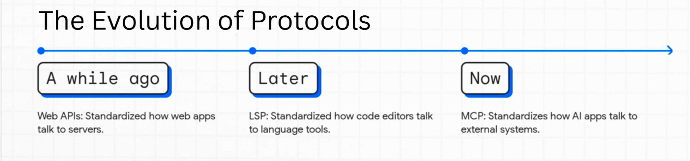
    - **Web APIs** standardized how web apps talk to servers.
    - The **Language Server Protocol (LSP)** did the same for code editors and their tools.
    - **MCP is that same evolutionary leap for AI**, creating a common language for how agents talk to the rest of the world.
- The core mission of MCP is to be an **open standard layer that flattens the N by M problem**.
- It is explicitly **not a proprietary thing** but designed to be a public good for the whole ecosystem.
- The goal is to make building with AI faster, more efficient, and more collaborative.

#### How MCP Works: Three Core Pillars (Interfaces)
  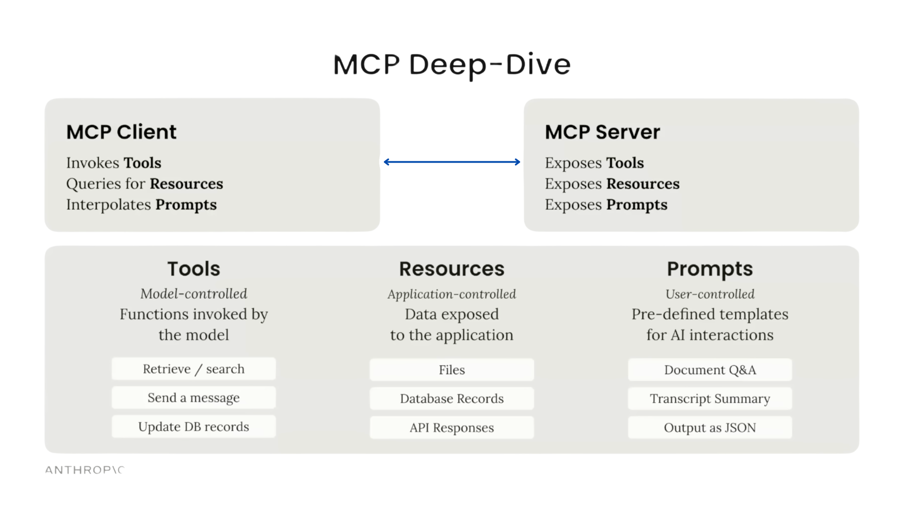
  MCP is built on three core pillars designed to create a clean separation of duties and make it crystal clear who's in control of any given interaction:
1. **Tools**
	- **Controlled by the AI model** so it can take action.
	- Developers expose capabilities like searching a database or writing to a file.
	- The **model decides when and how to use those tools** to accomplish its goal.

2. Resources
	- **Controlled by the application**.
	- Allows developers to feed the AI rich, structured information beyond plain text.
	- Examples include attaching files, surfacing error logs, or sending complex JSON objects.
	- The application developer decides what important context the AI needs.

3. Prompts
	- **Controlled by the user**.
	- Function like slash commands in apps like Slack or Discord.
	- A simple user shortcut (e.g., `/summarize_this_pull_request`) kicks off complex multi-step actions.
	- This puts **direct powerful control** back in the user's hands.

#### The Future Vision: The MCP Registry and Self-Evolving Agents

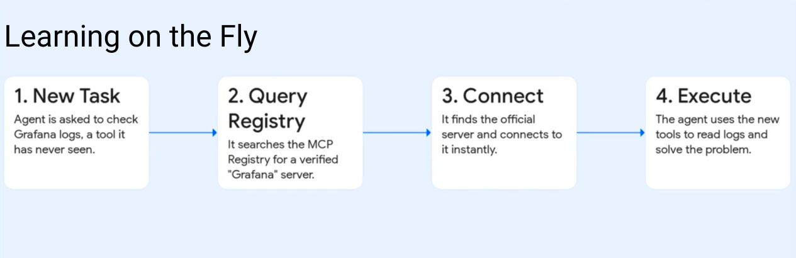
- **MCP lays the foundation for the next generation of AI**, enabling agents that can learn, grow, and evolve on their own.
- The key to this future is the **MCP Registry**.
- **The MCP Registry** is imagined as a global centralized directory, like an app store for AI tools and capabilities.
- Its function allows an AI agent to:
    - **Search for** new tools **Verify** their authenticity
    - **Dynamically connect** to brand new tools it's never encountered
    - **Real-world example**: 
        - An agent needs to check logs in Grafana but has no idea what Grafana is.
        - Instead of failing, it pings the MCP registry, searches for a verified Grafana server, finds the official one, and instantly connects.
        - The agent uses these new tools to read the log and complete the task.
        - This demonstrates the agent **literally teaching itself a new skill on the fly**.
- The ultimate vision: agents that are **no longer limited to their original tools**.
- They will **proactively discover and integrate new capabilities** by themselves.
- The agent will give itself context and evolve to meet whatever new challenge comes its way.

### SDLC
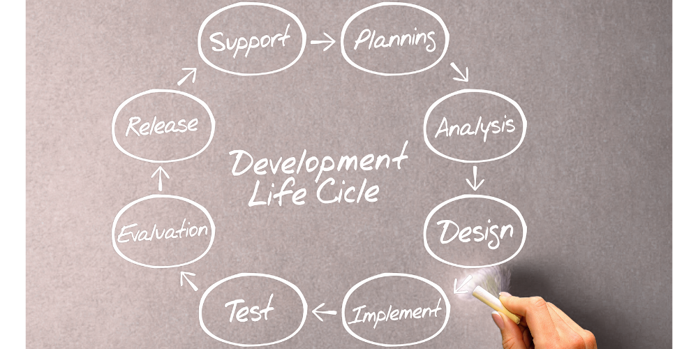

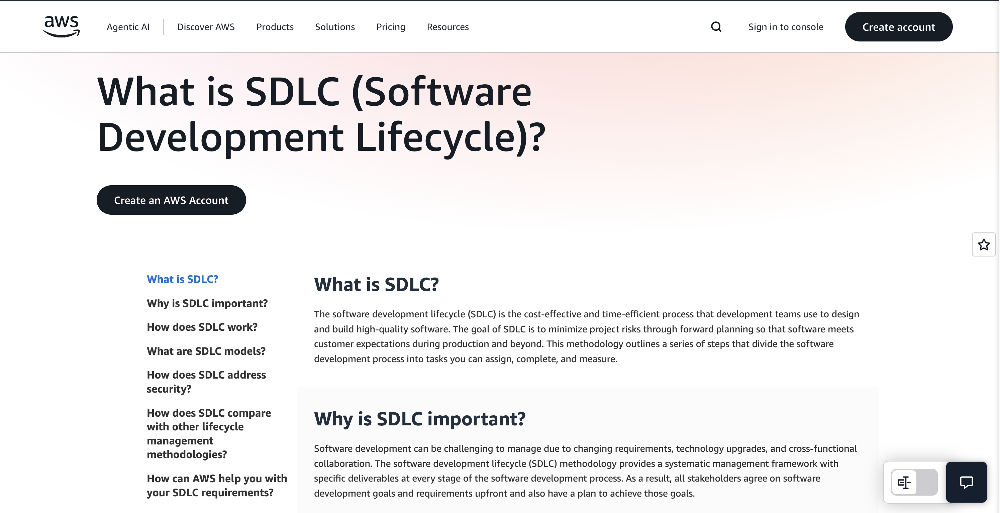

[What is Software Development Life Cycle](https://aws.amazon.com/what-is/sdlc)

### Super Claude Framework
[Source](https://github.com/SuperClaude-Org/SuperClaude_Framework)

### The BMAD METHOD — AI Agent Framework
[Source](https://github.com/bmad-code-org/BMAD-METHOD)

### FAQ

#### Q: How many tokens do I get with Claude Code Pro plan?

**A:** Pro plan users get approximately **44,000 tokens per 5-hour period**, which translates to roughly **10-40 prompts** depending on codebase complexity and task requirements.

- Usage limits reset every 5 hours (rolling window)
- Only access to Claude Sonnet 4 (no Opus 4 access)

#### Q: How are tokens calculated in Claude Code?

**A:** Tokens include everything in your interaction:

**Text Tokenization:**
- Basic formula: `tokens ≈ number of words + punctuation marks`
- Example: "Hello, world!" = approximately 4 tokens (use claude tokenizer to calculate tokens [Tokenizer for Claude 4](https://claude-tokenizer.vercel.app/))
- Uses BPE (Byte Pair Encoding) for subword tokenization

**What Counts Toward Your Limit:**
- Your prompts and questions
- Claude's responses and explanations  
- System instructions and tool definitions
- File content that Claude reads
- Project structure analysis
- Images: `tokens = (width px × height px) / 750`

**Rough Conversion:**
- 1 token ≈ 0.75 words (English text)
- 1,000 tokens ≈ 750 words
- 44,000 tokens ≈ 33,000 words

#### Q: How many lines of code can I write with 44,000 tokens?

**A:** **Theoretical capacity:** ~2,900-3,400 lines of pure code (13-15 tokens per line average)

**Practical reality:** Effective for projects with **1,000-2,000 lines** because tokens are shared across:
- Reading existing codebase
- Claude's analysis and suggestions
- Back-and-forth conversation
- File modifications and explanations
- Project context loading

#### Q: What happens when I run multiple Claude Code sessions in different terminals?

**A:** Two types of "sharing" occur:

**1. Usage Limits (Shared Pool):**
- All Claude Code sessions share the same 44,000 token allowance
- Multiple sessions will exhaust your limits faster
- Running 3 parallel sessions ≈ 3-13 prompts per session before hitting limits

**2. Conversation Context (Independent):**
- Each terminal has separate conversation history
- Claude in tab 1 doesn't know what happened in tab 2
- Each session analyzes codebases independently

#### Q: How do Git worktrees affect Claude Code sessions?

**A:** Git worktrees create an interesting hybrid situation:

**Separate Working Directories:**
- Each worktree shows different file contents
- Changes committed in feature X won't appear in feature Y's files
- Each Claude session sees different code states

**Shared Git Metadata:**
- All worktrees share the same `.git` directory
- Git history, branches, and commit logs are visible across all worktrees
- Claude can see that commits happened in other features (but not the actual code changes)

**Example:**
```bash
# Terminal 1: feature/auth
git commit -m "Add auth middleware"

# Terminal 2: feature/payment  
cat middleware.js        # Won't show auth changes
git log --oneline --all  # WILL show the auth commit
```

#### Q: How can I get completely separate Claude Code contexts?

**A:** Use **separate repository clones** instead of worktrees:

```bash
# Instead of worktrees:
~/project-auth/     # Complete separate clone
~/project-payment/  # Complete separate clone

# Benefits:
# - Separate .git directories
# - Independent Git histories  
# - No shared state whatsoever
# - Claude sees completely isolated projects
```

#### Q: How can I maximize my Claude Code Pro usage?

**A:** **Session Management:**
- Use `/compact` command to reduce context in long sessions
- Close unused sessions to avoid accidental token consumption
- Time your sessions to align with your peak coding periods
- Start fresh contexts for different types of work

**Token Efficiency:**
- Batch similar tasks together
- Use `/model` command strategically (Sonnet 4 only on Pro)
- Be specific in prompts to avoid back-and-forth
- Work on one feature at a time when possible

**Project Structure:**
- Create concise CLAUDE.md files for project context
- Use selective file reading when possible

### References
- https://github.com/adrianhajdin/ecommerce_sanity_stripe
- https://docs.anthropic.com/en/docs/claude-code/quickstart
- https://www.anthropic.com/engineering/claude-code-best-practices
- https://docs.anthropic.com/en/docs/claude-code/slash-commands
- https://www.anthropic.com/engineering/building-effective-agents
- https://www.anthropic.com/news/how-anthropic-teams-use-claude-code
- https://modelcontextprotocol.io/docs/getting-started/intro
- https://www.youtube.com/watch?v=kQmXtrmQ5Zg
- https://github.com/modelcontextprotocol/servers?tab=readme-ov-file#%EF%B8%8F-official-integrations
- https://github.com/OneRedOak/claude-code-workflows/tree/main
- https://www.youtube.com/watch?v=xOO8Wt_i72s
- https://github.com/microsoft/playwright-mcp
- https://aws.amazon.com/what-is/sdlc/
- https://developers.googleblog.com/en/a2a-a-new-era-of-agent-interoperability/
- https://github.com/cline/cline
- https://github.com/lastmile-ai/mcp-agent
- https://github.com/yamadashy/repomix
- https://tmuxcheatsheet.com/
- https://obsidian.md/