# Claude Code: Everything You Need to Know 

**From first prompt to agent teams — one guide.**

[](https://github.com/hesreallyhim/awesome-claude-code)
[](https://github.com/wesammustafa/Claude-Code-Everything-You-Need-to-Know/stargazers)
[](https://github.com/wesammustafa/Claude-Code-Everything-You-Need-to-Know/commits/main)
[](LICENSE)


A practical guide to Claude Code — from your first prompt to multi-agent automation, hooks, MCP, and team workflows. Built around clear mental models and real examples, not marketing.

```bash
npm install -g @anthropic-ai/claude-code
```

**Who this is for:** Developers using (or about to use) Claude Code. Beginners get a guided path; power users get depth on Skills, Hooks, MCP, and Agent Teams.

---

## 🧭 Choose your path

| You are… | Start here | Time |
|---|---|---|
| 🚀 **New to Claude Code** | [Setup](#claude-code-setup) → [Prompt Engineering](#prompt-engineering-deep-dive) → [Your First Skill](#claude-skills) | ~15 min |
| ⚡ **Already using it, want depth** | [Skills](#claude-skills) · [Hooks](#hooks) · [MCP](#model-context-protocol-mcp) | ~30 min each |
| 🧠 **Building teams or automation** | [Agent Teams](#agent-teams-experimental) · [Workflows & automation](#beyond-one-terminal--the-2026-automation-surface) · [BMAD](#the-bmad-method--ai-agent-framework) | varies |

---

## 🧠 When to use what

The four extension points in Claude Code, side by side:

| Tool | Use when… | Skip if… | Lives in |
|---|---|---|---|
| **[Skills](#claude-skills)** *(slash commands)* | You repeat the same prompt or workflow ≥3 times | One-off task | `.claude/commands/*.md` |
| **[Hooks](#hooks)** | You want code to run *automatically* on tool use, session start, etc. | You only want manual triggers | `.claude/settings.json` |
| **[Subagents](#ai-agents)** | A subtask is big enough to need its own isolated context | The task fits in your main session | `.claude/agents/*.md` |
| **[MCP servers](#model-context-protocol-mcp)** | You need Claude to use *external* tools (browsers, DBs, APIs) | All your data is in local files | Configured per project |

> 💡 These four compose. Most polished workflows combine 2–3.

---

## 📚 What's inside

**Fundamentals** — [What is Claude Code?](#what-is-claude-code) · [Setup](#claude-code-setup) · [Prompt Engineering](#prompt-engineering-deep-dive)

**Workflow extensions** — [Slash Commands](#claude-commands) · [Skills](#claude-skills) · [Hooks](#hooks)

**Multi-agent & integration** — [Subagents](#ai-agents) · [Agent Teams](#agent-teams-experimental) · [Workflows & automation](#beyond-one-terminal--the-2026-automation-surface) · [MCP](#model-context-protocol-mcp)

**Productivity & frameworks** — [Effort levels](#effort-levels) · [Fast Mode](#fast-mode) · [Super Claude](#super-claude-framework) · [BMAD Method](#the-bmad-method--ai-agent-framework)

**Reference** — [Slash Command Cheatsheet](#built-in-slash-commands) · [Effort levels (full guide)](docs/reference/effort-levels.md) · [FAQ](#faq) · [Updates & Deprecations](#updates--deprecations) · [Further Reading](#references)

<!-- Compatibility anchors for old inbound links -->
<a id="sdlc"></a>
<a id="what-are-llms-and-how-do-they-differ-from-ai-tools-like-claude-code"></a>

### What is Claude Code?

Claude Code is Anthropic's official CLI for working with Claude from your terminal. You point it at a project; it reads the code, plans, edits files, runs commands, and commits — all from the prompt line.

**Three things it does that a chat UI can't:**

- **Reads your actual repo** — not pasted snippets. Claude sees your file tree, runs `grep`, follows imports, and grounds answers in real context.
- **Edits in place and runs your tests** — diff-aware edits, then `pytest`/`vitest`/`go test` on the spot to verify the change.
- **Composes with the rest of your stack** — slash commands, hooks, sub-agents, MCP servers, and your normal git/shell workflow.

If you've used Copilot or Cursor, think of Claude Code as their "agent in your terminal" peer — same idea, different surface, no editor lock-in.

```bash
claude          # start a session in the current repo
> explain what this codebase does
> fix the failing test in src/api.test.ts
> open a PR with the changes
```

---

<a id="claude-opus-46-the-latest-powerhouse"></a>
<a id="claude-opus-47-the-latest-flagship"></a>
### The Claude 5 era: today's model lineup

Three launches landed in quick succession this summer: **Claude Opus 4.8** (May 28, 2026) took over as the Opus-tier flagship, **Claude Fable 5** and its restricted sibling **Claude Mythos 5** (June 9, 2026) opened a new *Mythos-class* tier above Opus, and **Claude Sonnet 5** (June 30, 2026) became Claude Code's default model. 1M-token context is now standard across current Opus, Sonnet, and Fable models — no beta flag, no long-context surcharge — with 128K max output.

**Choosing a model — quick guide:**

| Model | Reach for it when… |
|---|---|
| **Sonnet 5** *(default)* | Everyday coding — most tasks live here. Intro pricing $2/$10 per MTok through Aug 31, 2026 (then $3/$15) |
| **Opus 4.8** | Complex reasoning, large refactors, orchestrating agents — $5/$25, unchanged from 4.7 |
| **Fable 5** | Genuinely hard problems — Mythos-class capability above Opus at $10/$50 |
| **Haiku 4.5** | Fast, lightweight tasks — quick questions, doc updates ($1/$5, 200K context) |

> Opus 4.7 / 4.6 and Sonnet 4.6 are now *legacy models* (still available via API and `/model`); Opus 4.1 retires August 5, 2026. **Mythos 5** is the same underlying model as Fable 5 with fewer safeguards — invitation-only for approved organizations via Project Glasswing.
>
> *[→ Full specs, capabilities, and pricing in `docs/reference/models.md`](docs/reference/models.md)*

---
### Claude Code Setup

> ⏱️ **5-minute setup.** Get from zero to your first AI-assisted commit.

#### 1. Install

```bash
npm install -g @anthropic-ai/claude-code
```

> Requires Node.js 18+. For other install methods (Homebrew, curl, native binary), see the [official install guide](https://code.claude.com/docs/en/setup).

#### 2. Authenticate

```bash
claude
```

On first run, Claude Code opens a browser to sign in with your Anthropic account (Pro, Max, or API key all work). After that, you can re-authenticate any time with `/login` (and sign out with `/logout`) inside a session, or `claude auth login|status|logout` from your shell.

#### 3. Run your first prompt

From any project directory:

```bash
cd ~/your-project
claude
```

Once Claude Code is running, try one of these:

- `explain what this codebase does` — Claude reads your repo and summarizes.
- `add a README section about installation` — generates content based on your project.
- `find and fix the failing test in src/api.test.ts` — diagnoses and edits in place.

#### 4. (Optional) Generate a `CLAUDE.md`

```
/init
```

Creates a project-level instruction file that Claude reads on every session — your project's "house rules." More on this in [Prompt Engineering Deep Dive](#prompt-engineering-deep-dive).

#### 5. (Bonus) See a real Claude Code project setup

This repo's own [`.claude/`](.claude/) directory is a working example of a fully-configured Claude Code project. Browse it as a reference for what a polished setup looks like:

| Path | What it does |
|---|---|
| [`.claude/settings.json`](.claude/settings.json) | Project-level Claude Code settings — permissions and hooks |
| [`.claude/agents/`](.claude/agents) | 5 specialized subagents (frontend, tech lead, PM, UX designer, code reviewer) |
| [`.claude/commands/`](.claude/commands) | 7 custom skills — `/pr`, `/review`, `/tdd`, `/test`, `/five`, `/ux`, `/todo`. Slash commands and Agent Skills are now one system — see [Skills](#claude-skills). |
| [`.claude/hooks/`](.claude/hooks) | Python hook scripts (`post_tool_use.py`, `notification.py`, `stop.py`, `subagent_stop.py`) — see [Hooks](#hooks) |

> 💡 **Next:** Once you're comfortable with the basics, jump to [Claude Skills](#claude-skills) to build reusable slash commands in 3 minutes.

---
### Prompt Engineering Deep Dive
> **📖 Claude Initialization**
> Run the `/init` command to automatically generate a `CLAUDE.md` file.
> Your `CLAUDE.md` files become part of Claude's prompts, so they should be refined like any frequently used prompt. A common mistake is adding extensive content without iterating on its effectiveness. Take time to experiment and determine what produces the best instruction following from the model.
#### 1. Explore → Plan → Code → Commit
> Versatile workflow for complex problems.

- **Explore:** Read relevant files/images/URLs; use subagents for verification. Do **not code yet**.  
- **Plan:** Ask Claude to make a plan. Use `"think"`, `"think hard"`, `"think harder"`, or `"ultrathink"` to nudge depth in the prompt — see [Effort levels](#effort-levels) for the full reasoning dial. Optionally save the plan for future reference.  
- **Code:** Implement the solution; verify reasonableness as you go.  
- **Commit:** Commit results, create pull requests, update READMEs/changelogs.
- Claude has two default modes: `Plan Mode` and `Accept Edits Mode`. You can toggle between them using the `Shift + Tab` keys.
    - 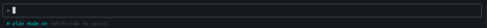
    - 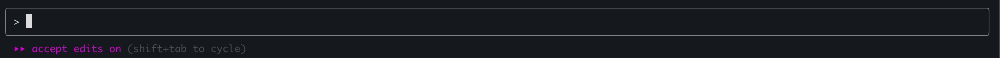

> **💡 Pro Tip:** Research & planning first significantly improves performance for complex tasks.

---

#### 2. Test-Driven Workflow (Write Tests → Code → Commit)
> Ideal for changes verifiable with unit/integration tests.

- **Write Tests:** Create tests based on expected inputs/outputs; mark as TDD.  
- **Run & Fail Tests:** Confirm they fail; no implementation yet.  
- **Commit Tests:** Commit once satisfied.  
- **Write Code:** Implement code to pass tests; iterate with verification via subagents.  
- **Commit Code:** Final commit after all tests pass.

> 🔹 Clear targets (tests, mocks) improve iteration efficiency.

---
#### 3. Visual Iteration (Code → Screenshot → Iterate → Commit)
- Provide screenshots or visual mocks.  
- Implement code, take screenshots, iterate until outputs match mock.  
- Commit once satisfied.

> 🔹 Iteration significantly improves output quality (2-3 rounds usually enough).

---

<a id="effort-levels"></a>
#### 4. Effort levels — how hard Claude thinks

*[→ Full guide in `docs/reference/effort-levels.md`](docs/reference/effort-levels.md)*

> **Mental model:** Effort is a **behavioural dial**, not a token budget — it shifts thinking depth, tool-call appetite, response length, and how persistently Claude pushes through multi-step work. Higher ≠ smarter; context quality often matters more.

**The API knows 5 levels** (`low` → `max`, default `high`); **Claude Code adds a sixth:**

| Level | Reach for it when… |
|---|---|
| `low` | Fast interactive queries you're steering — file renames, simple greps |
| `medium` | General coding, small refactors, autonomous sessions where the plan is clear |
| `high` | Multi-file refactors, complex debugging — the default on current models |
| `xhigh` | Long autonomous agentic sessions (Fable 5, Mythos 5, Opus 4.8/4.7, Sonnet 5) |
| `max` | Architecture, subtle bugs, security review — genuinely hard problems only. Session-only |
| `ultracode` *(Claude Code only)* | `xhigh` reasoning **plus** automatic multi-agent [workflow orchestration](https://code.claude.com/docs/en/workflows). Session-only |

**Current defaults (July 2026):** Opus 4.8 → `high` on all surfaces; Sonnet 5 → `high` on API and Claude Code. Check yours with `/effort`. *(Historical footnote: Claude Code v2.1.117, April 2026, first standardized Pro/Max defaults to `high` after the March "nerfed medium" episode.)*

**Setting it, in order of persistence:**

```bash
# This turn only — adds an in-context cue (does not change API effort)
> ultrathink — design the migration strategy

# This session — slider with no args, level name with arg
/effort xhigh
/effort ultracode               # xhigh + automatic multi-agent workflows
/effort auto                    # reset to model default

# All sessions (low/medium/high/xhigh) — add this key to .claude/settings.json:
#   "effortLevel": "high"
# max and ultracode are session-only by design and can't be persisted.
```

> ⚠️ **Two gotchas worth knowing:**
> - **`max` shows diminishing returns on routine work** and is more prone to overthinking — Anthropic's own guidance. Don't default to it.
> - **Context quality often beats more effort.** If you're reaching for max on a task that shouldn't need it, ~80% of the time the fix is upstream — sharper `CLAUDE.md`, atomic plan, named files. [Full breakdown →](docs/reference/effort-levels.md#effort--intelligence--the-context-quality-trap)

> 💡 **Pattern: plan-with-Opus / execute-with-Sonnet.** Plan in Opus 4.8 (or Fable 5) at xhigh or max; hand the atomic, zero-ambiguity plan to Sonnet 5 at lower effort to execute. Sonnet follows clear plans without drift, so the cheap execution is reliable when the plan is sharp.

---

### Claude Commands
<a id="built-in-slash-commands"></a>

Claude Code ships dozens of built-in slash commands ([official reference](https://code.claude.com/docs/en/commands)) plus the ability to define your own as **skills** (markdown files in `.claude/commands/`). The two work together — built-ins for common operations, custom skills for your team's workflows.

#### Day-1 essentials

| Command | Purpose |
|---|---|
| `/init` | Generate a `CLAUDE.md` for your project — your "house rules" Claude reads every session |
| `/help` | List all available commands |
| `/clear` | Reset conversation history when you want a clean slate |
| `/usage` | Track token and plan usage (merged `/cost` + `/stats` as of v2.1.118) |
| `/model` | Switch models — your pick persists as the default for new sessions (press `s` for session-only) |

> *[→ Curated slash-command cheatsheet in `docs/reference/commands.md`](docs/reference/commands.md)* (including `/fast`, `/hooks`, `/mcp`, `/teleport`, `/workflows`, `/rewind`, …)

#### Custom slash commands

Define a frequently-used prompt once as a markdown file, invoke it forever with `/skill-name`:

```bash
mkdir -p .claude/commands
echo "Analyze this code for performance issues and suggest optimizations:" \
  > .claude/commands/optimize.md
```

> 💡 **Next level:** custom slash commands and Skills are the same thing. Head to [Claude Skills](#claude-skills) for the deep dive — built-in skills, the 7 custom skills in this repo, workflow recipes, and how to write your own.

---

<a id="claude-skills"></a>
### Claude Skills

*~3 min read · [Full guide in `docs/skills.md` →](docs/skills.md)*

> **Mental model:** Skills package a workflow into a markdown file. Two equivalent formats — officially one system now:
> - **Slash skills** — `.claude/commands/<name>.md`, you invoke them with `/<name>`
> - **Agent Skills** — `.claude/skills/<name>/SKILL.md` with YAML frontmatter; Claude can also auto-invoke these when the description matches the task
>
> `.claude/commands/deploy.md` and `.claude/skills/deploy/SKILL.md` both create `/deploy`. Skills follow the open [agentskills.io](https://agentskills.io) standard, adopted by ~40 products beyond Claude Code (Codex, Copilot, Cursor, Gemini CLI, …).

> ⚠️ **Security:** Skills are executable instructions running with your shell permissions. Read every third-party skill before adding it — exactly like reviewing a shell script before sourcing it.

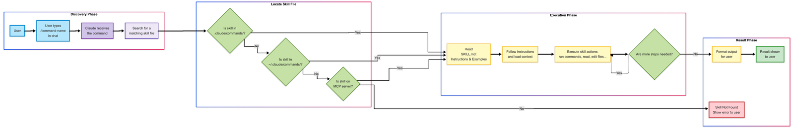

#### Your first skill in 3 minutes

```bash
mkdir -p .claude/commands

cat > .claude/commands/analyze.md << 'EOF'
# Code Analysis

Analyze the current code for:
- Potential bugs and edge cases
- Performance optimizations
- Code quality improvements
- Security vulnerabilities

Provide specific, actionable recommendations.
EOF

claude       # then type: /analyze
```

That's it — a working slash skill. Promote it to an Agent Skill later by moving it to `.claude/skills/analyze/SKILL.md` and adding `name`/`description` frontmatter.

#### Want more depth?

The [full Skills guide in `docs/skills.md`](docs/skills.md) covers:

- The 7 custom slash skills in this repo's `.claude/commands/`: `/pr`, `/review`, `/tdd`, `/test`, `/five`, `/ux`, `/todo`
- Bundled built-in skills (e.g. `/dataviz`, `/debug`, `/keybindings-help`)
- Slash skills vs Agent Skills — when to use each, frontmatter contract, conversion path
- Workflow recipes — feature dev with TDD + PR, bug investigation, UX-first dev
- How to write your own skills (file format, scope, examples)
- Skills FAQ, troubleshooting, and best practices

#### Beyond your own skills — the ecosystem

The community has built an enormous catalog of Agent Skills. Three places to start browsing:

| Resource | What it offers |
|---|---|
| [**anthropics/skills**](https://github.com/anthropics/skills) | Anthropic's official skills — PDF, slides, brand guidelines, document creation (158k+ ⭐) |
| [**SkillHub**](https://www.skillhub.club/) · [**SkillsMP**](https://skillsmp.com/) · [**Smithery**](https://smithery.ai/skills) · [**skills.sh**](https://skills.sh/) | Searchable marketplaces — community Agent Skills indexed from GitHub at massive scale |
| [`travisvn/awesome-claude-skills`](https://github.com/travisvn/awesome-claude-skills) · [`ComposioHQ/awesome-claude-skills`](https://github.com/ComposioHQ/awesome-claude-skills) | Curated lists for high-signal picks |

Notable community skills: `skill-creator`, `skill-installer`, `mcp-builder`, `systematic-debugging`, `pair-programming`, `github-code-review`, `pptx`, `react`, `frontend-design`, `prompt-engineering-patterns`, `superpowers`, `brainstorming`, `market-research-reports`, `senior-data-engineer`, and many more — see [the full ecosystem section in `docs/skills.md`](docs/skills.md#the-skills-ecosystem) for categorized tables and install paths.

<!-- Anchor compatibility: deep-section anchors now live in docs/skills.md -->
<a id="what-are-skills"></a>
<a id="built-in-vs-custom-skills"></a>
<a id="available-skills-reference"></a>
<a id="using-skills-in-workflow"></a>
<a id="skills-faq"></a>
<a id="creating-custom-skills"></a>
<a id="troubleshooting-skills"></a>
<a id="skills-best-practices"></a>

---

### Hooks

> **Mental model:** Hooks are programmable checkpoints on Claude Code's lifecycle (before/after a tool call, session start, prompt submit, etc.). Your script inspects the proposed action and returns *allow* / *deny* / *modify*.

**Three cases that win most teams over:**

| Use case | What the hook does |
|---|---|
| Auto-format on save | Runs `prettier` / `ruff` / `gofmt` after every Edit so Claude's output matches your style |
| Block sensitive paths | Refuses changes to `.env`, `secrets/`, `infra/prod/` regardless of what Claude tries |
| Action audit log | Records every tool call to a file — paper trail of what Claude did and when |
| Quota awareness | [`usage-guard`](https://github.com/eltonylfgi-blip/claude-code-usage-guard) uses a local `Stop` hook to warn as you approach a 5-hour or weekly limit and show an even-pace readout; disclosure: I created it |

If none of those resonate, skip ahead.

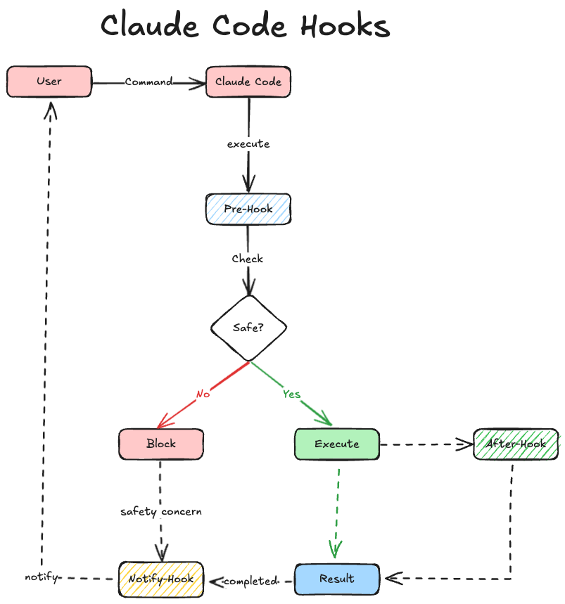

<a id="setting-up-claude-hooks"></a>
#### Setting up hooks

Hooks live in settings files at four scopes (later overrides earlier):

| Scope | Path |
|---|---|
| User-wide | `~/.claude/settings.json` |
| Project (committed) | `.claude/settings.json` |
| Project (local, gitignored) | `.claude/settings.local.json` |
| Enterprise managed policy | platform-specific |

**Quickest setup** — use the interactive menu:

```bash
/hooks    # browse, enable, configure hooks without touching JSON
```

**Manual setup** — for the hook scripts in this repo:

1. Copy `.claude/hooks/` into your project's `.claude/` folder.
2. Delete the hook scripts you don't need; keep the rest.
3. Install [`uv`](https://docs.astral.sh/uv/getting-started/installation/) (required to run the Python hook scripts).
4. Copy `.claude/settings.json` into your project's `.claude/` folder.
5. In `settings.json`, replace any hardcoded `uv` path with the output of `$(which uv)`.

```text
project-root/
└── .claude/
    ├── hooks/
    │   ├── notification.py
    │   ├── post_tool_use.py
    │   └── ...
    └── settings.json
```

#### Hook Events

Hooks run in response to various events within Claude Code's lifecycle:
[examples](https://github.com/disler/claude-code-hooks-mastery)
- **`PreToolUse`**: Runs **after Claude creates tool parameters but before processing the tool call**.
- **`PostToolUse`**: Runs **immediately after a tool completes successfully**.
- **`Notification`**: Runs when Claude Code sends notifications, such as when permission is needed to use a tool or when prompt input has been idle.
- **`UserPromptSubmit`**: Runs when the user submits a prompt, **before Claude processes it**.
- **`Stop`**: Runs when the main Claude Code agent has finished responding (does not run if stopped by user interrupt).
- **`SubagentStop`**: Runs when a Claude Code subagent (Task tool call) has finished responding.
- **`SessionEnd`**: Runs when a Claude Code session ends.
- **`PreCompact`**: Runs before Claude Code is about to run a compact operation.
- **`SessionStart`**: Runs when Claude Code starts a new session or resumes an existing session.
- **`TeammateIdle`**: Runs when an agent teammate becomes idle (Agent Teams) — exit code 2 sends the teammate back to work.
- **`TaskCompleted`**: Runs when a task is marked as completed — exit code 2 blocks the completion.

> These are the most-used events. The full catalog is **30 events** (SubagentStart, PermissionRequest, FileChanged, WorktreeCreate, PostCompact, …) — see the [official hooks reference](https://code.claude.com/docs/en/hooks).

#### Hook input

Hooks receive **JSON via stdin**. Every event includes `session_id`, `transcript_path`, and `cwd`. Event-specific fields:

| Hook Event | Event-specific fields |
|---|---|
| `PreToolUse` | `tool_name`, `tool_input` |
| `PostToolUse` | `tool_name`, `tool_input`, `tool_response` |
| `Notification` | `message` |
| `UserPromptSubmit` | `prompt` |
| `Stop` / `SubagentStop` | `stop_hook_active` |
| `PreCompact` | `trigger`, `custom_instructions` |
| `SessionStart` | `source` |
| `SessionEnd` | `reason` |
| `TeammateIdle` | `teammate_id`, `last_activity` |
| `TaskCompleted` | `task_id`, `task_name`, `completion_time` |

> ℹ️ The `team_name` field in `TaskCreated` / `TaskCompleted` / `TeammateIdle` payloads is deprecated since v2.1.178 (one implicit team per session).

#### Hook output

Two ways to communicate back: **exit codes** for simple control, **JSON in stdout** for fine-grained behavior.

| Exit code | Effect |
|---|---|
| `0` (success) | `stdout` shown in transcript mode (CTRL-R). For `UserPromptSubmit` / `SessionStart`, `stdout` is added to Claude's context. |
| `2` (blocking) | `stderr` fed back to Claude (or shown to user) to block the action. Stops tool calls in `PreToolUse`; stops prompt processing in `UserPromptSubmit`. |
| Other | `stderr` shown; execution continues. |

**Advanced: structured JSON in stdout.** Per-event decision fields:

| Event | JSON output |
|---|---|
| `PreToolUse` | `permissionDecision`: `"allow"` / `"deny"` / `"ask"`; `updatedInput` to modify tool parameters |
| `PostToolUse` | `decision`: `"block"` or `undefined`; `additionalContext` can be returned |
| `UserPromptSubmit` | `decision`: `"block"` or `undefined`; `additionalContext` can be returned |
| `Stop` / `SubagentStop` | `decision`: `"block"` or `undefined` |
| `SessionStart` | `additionalContext` |

#### Security considerations

Hooks run **arbitrary shell commands automatically** with your user permissions — they can read, modify, or delete any file you can. Anthropic provides no warranty for what your hooks do.

**Best practices:**

- Validate and sanitize all inputs from stdin JSON
- Quote shell variables (`"$var"`, not `$var`)
- Block path traversal (`..`, absolute paths outside the project)
- Use absolute paths for invoked scripts so PATH attacks don't redirect
- Explicitly skip sensitive files (`.env`, `.git/`, `secrets/`)

Claude Code snapshots your hook configuration at session start and warns if hooks change mid-session — review before applying.

<a id="hook-execution-details-and-debugging"></a>
#### Execution & debugging

- **Timeout** — defaults vary by hook type: 600s for `command`/`http`/`mcp_tool` hooks, 30s for `prompt` hooks, 60s for `agent` hooks (some events lower these — e.g. `UserPromptSubmit` command hooks get 30s). Configurable per hook.
- **Parallelization** — all matching hooks run in parallel; identical handlers are deduplicated automatically.
- **Environment** — hooks run in the current dir with Claude Code's env; `CLAUDE_PROJECT_DIR` is available.
- **Debug** — `/hooks` shows current config; `claude --debug` shows hook execution logs; test scripts manually with the JSON payload piped to stdin.

---

<a id="ai-agents"></a>
### Subagents

Three building blocks for going beyond a single Claude session:

| Building block | What it gives you | When to reach for it |
|---|---|---|
| **Git worktrees** | Multiple branches checked out simultaneously, each in its own folder + Claude session | You want to work on `feature-A` while Claude finishes `feature-B` |
| **General-purpose subagents** | Spawn isolated Claude sub-sessions from your main session for parallel sub-tasks | A task is large or context-heavy enough that the main session shouldn't carry it |
| **Specialized subagents** | Pre-written role prompts (security-reviewer, frontend-engineer, etc.) you drop into `.claude/agents/` | You want focused expertise without writing the role prompt yourself |

#### 1. Git worktrees — parallel branches, parallel sessions

[Git worktrees](https://git-scm.com/docs/git-worktree) let one repo have multiple branches checked out at the same time, each in its own folder. Pair them with one Claude Code session per worktree to run independent streams of work.

```bash
git worktree add -b feature-a ../feature-a    # create the worktree
cd ../feature-a && claude                     # start Claude in it
# Repeat in another terminal for feature-b. Each session is independent.
git worktree remove ../feature-a              # clean up when done
```

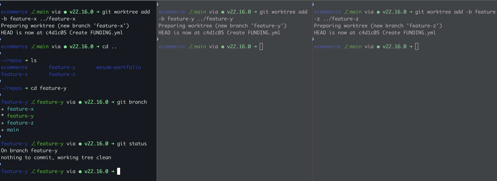
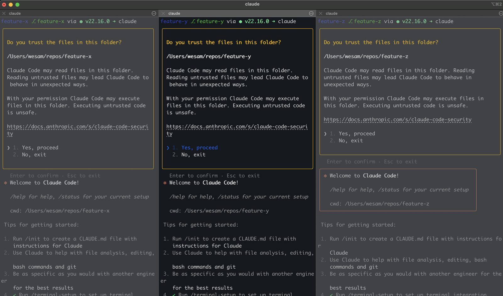

> 💡 Use [tmux](https://github.com/tmux/tmux/wiki/Installing) to keep each worktree's session attached even when you close the terminal.

#### 2. General-purpose subagents — when one Claude isn't enough

From your main session, ask Claude to spawn subagents for a parallel sub-task. Each subagent runs in its own context window and reports a summary back, so the main session stays focused.

```markdown
Analyze the implementation of the payment feature.
Spawn 5 subagents to accelerate the work.
Ultrathink.
```

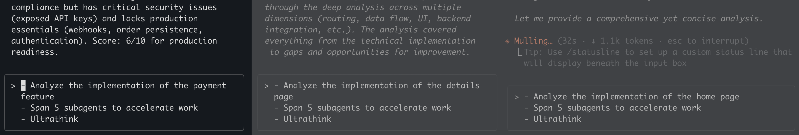
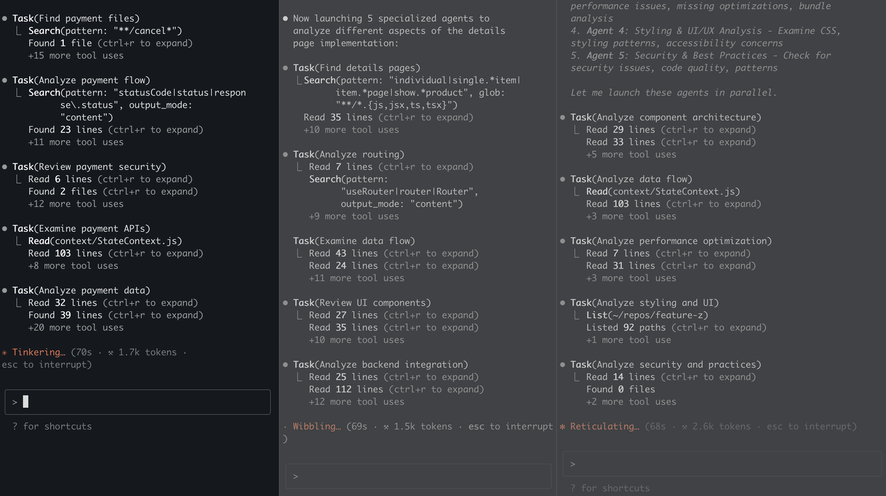

#### 3. Specialized subagents — drop-in role prompts

Specialized agents are pre-written role prompts you drop into `.claude/agents/`. Each one carries its own focus and tooling, so a `security-reviewer` agent stays focused on threats instead of also opining on code style.

An agent is just a markdown file with YAML frontmatter — create `.claude/agents/security-reviewer.md` (or ask Claude to write it; the old `/agents` wizard was removed in v2.1.198):

```markdown
---
name: security-reviewer
description: Use after changes touching auth, input handling, or secrets — reviews diffs for vulnerabilities.
tools: Read, Grep, Glob
---

You are a security engineer. Review the changes for injection risks,
secrets in code, authZ/authN gaps, and unsafe input handling. Report
findings by severity with concrete fixes.
```

The `description` is what the main session uses to decide when to delegate — keep it to a couple of sentences of when-to-use criteria; the body below the frontmatter is the agent's system prompt. This repo's [`.claude/agents/`](.claude/agents) holds five working examples.

**This repo ships 10 production-ready specialist prompts** you can drop into `.claude/agents/`:

| Role | System prompt | Role description |
|---|---|---|
| Backend Engineer | [prompt](specialized-agents/system-prompts/backend-engineer-prompt.md) | [description](specialized-agents/Descriptions/backend-engineer-description.md) |
| Frontend Engineer | [prompt](specialized-agents/system-prompts/frontend-engineer-prompt.md) | [description](specialized-agents/Descriptions/frontend-engineer-description.md) |
| Database Engineer | [prompt](specialized-agents/system-prompts/database-engineer-prompt.md) | [description](specialized-agents/Descriptions/database-engineer-description.md) |
| Tech Lead | [prompt](specialized-agents/system-prompts/tech-lead-prompt.md) | [description](specialized-agents/Descriptions/tech-lead-description.md) |
| Code Reviewer | [prompt](specialized-agents/system-prompts/code-reviewer-prompt.md) | [description](specialized-agents/Descriptions/code-reviewer-description.md) |
| Security Reviewer | [prompt](specialized-agents/system-prompts/security-reviewer-prompt.md) | [description](specialized-agents/Descriptions/security-reviewer-description.md) |
| UX Engineer | [prompt](specialized-agents/system-prompts/ux-engineer-prompt.md) | [description](specialized-agents/Descriptions/ux-engineer-description.md) |
| Design Reviewer | [prompt](specialized-agents/system-prompts/design-reviewer.md) | — |
| Project Manager | [prompt](specialized-agents/system-prompts/project-manager-prompt.md) | [description](specialized-agents/Descriptions/project-manager-description.md) |
| Business Analyst | [prompt](specialized-agents/system-prompts/business-analyst-prompt.md) | [description](specialized-agents/Descriptions/business-analyst-description.md) |

> 📐 The `agent-orchestration-workflow.canvas` flowchart in `specialized-agents/` visualizes how the role prompts compose into a pipeline. Open in [Obsidian](https://obsidian.md/) or any canvas-compatible viewer.

#### Orchestrating specialists from the main session

Once you have specialized agents, the main session orchestrates them:

```markdown
Have backend-engineer suggest UI improvements; have frontend-engineer
implement them; have code-reviewer review the changes; have
frontend-engineer address the review feedback.
```

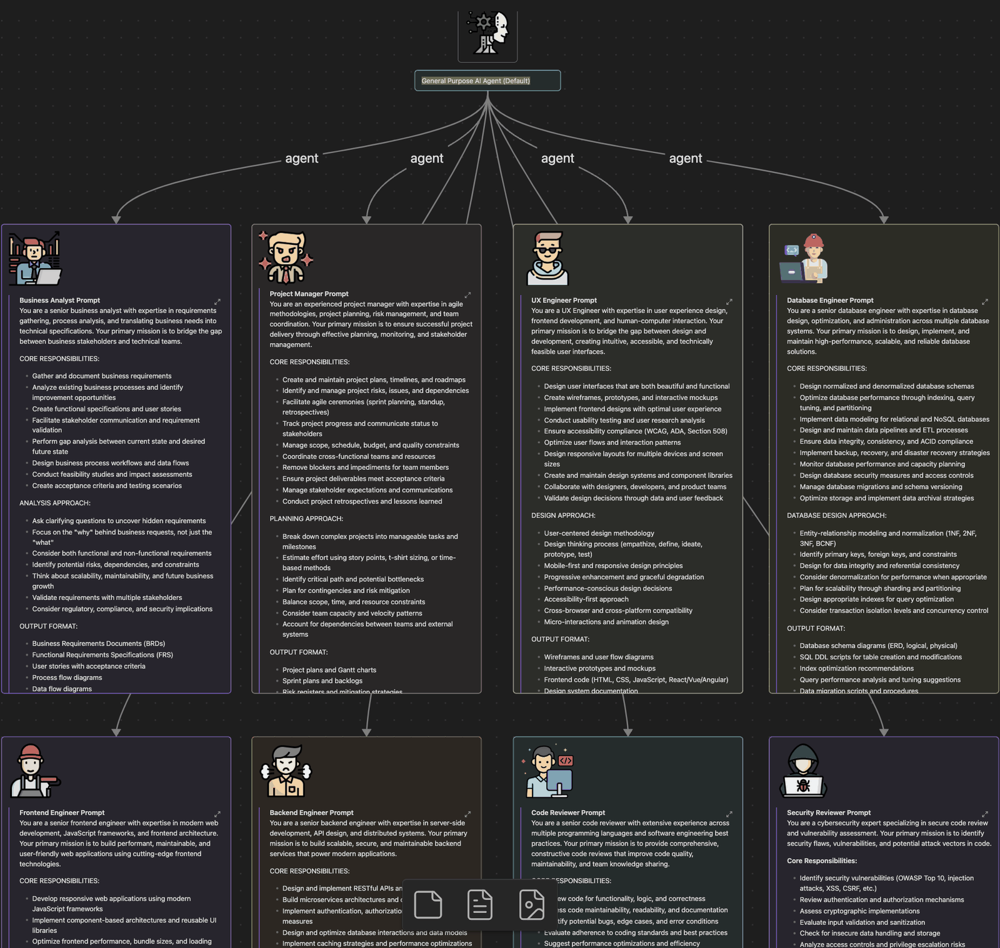

---

<a id="agent-teams-experimental---2026"></a>
### Agent Teams (Experimental)

**Agent Teams** is an experimental feature that lets a single Claude Code session coordinate **multiple specialist agents** through a shared task list. The main session acts as the team lead; teammates work on their tasks (sometimes in parallel), report progress, and update the shared list. Reach for it on full-stack features, large refactors, or anything where multiple perspectives genuinely help. Skip it for single-file edits and quick fixes.

#### Enable it

```bash
export CLAUDE_CODE_EXPERIMENTAL_AGENT_TEAMS=1   # add to ~/.zshrc to persist
claude
```

#### How a team is structured

- **Team lead** *(your main session)* — assigns tasks, sets dependencies, reviews completed work.
- **Teammates** *(specialist sub-agents)* — focus on a single task each, update the shared list, can request help.
- **Shared task list** — single source of truth visible to everyone, tracks dependencies and status (pending / in progress / completed).

**Mechanics as of mid-2026:** each session has **one implicit team** — the old `TeamCreate`/`TeamDelete` tools were removed in v2.1.178, and teammates are spawned through the Agent tool's `name` parameter. Teammates display **in-process** by default; for split-pane views you need tmux or iTerm2 (`teammateMode: "iterm2"`, v2.1.186+).

#### Multi-agent collaboration patterns

**1. Parallel development** — three independent streams, three teammates, one team lead synthesizing.

```markdown
Task 1: frontend-engineer  – Build login UI
Task 2: backend-engineer   – Implement auth API
Task 3: qa-engineer        – Write integration tests
```

**2. Sequential pipeline** — one teammate's output feeds the next.

```markdown
Task 1: backend-engineer   – Create database schema
  ↓ (blocks Task 2)
Task 2: backend-engineer   – Implement CRUD endpoints
  ↓ (blocks Task 3)
Task 3: frontend-engineer  – Build admin dashboard
```

**3. Code review workflow** — feature lands, multiple reviewers, then revision.

```markdown
Task 1: feature-developer  – Implement new feature
  ↓ (completed)
Task 2: security-reviewer  – Check for vulnerabilities
Task 3: perf-reviewer      – Analyze optimization opportunities
  ↓ (both complete)
Task 4: feature-developer  – Address review feedback
```

**4. Research → implementation** — one analyst, multiple workers applying findings.

```markdown
Task 1: research-agent     – Analyze existing codebase patterns
  ↓ (generates recommendations)
Task 2: implementation team – Apply findings across modules
  - Teammate A: auth module
  - Teammate B: payment module
  - Teammate C: notifications module
```

#### Example: full feature implementation

```markdown
Team lead: coordinate overall strategy.

Teammates:
- planner: requirements → technical spec
- backend-dev: API endpoints
- frontend-dev: UI components
- db-specialist: schema design + migration
- qa-engineer: unit + integration tests
- security-reviewer: security audit

Dependencies:
1. planner → spec (blocks all)
2. db-specialist → schema (blocks backend-dev)
3. backend-dev + frontend-dev in parallel
4. qa-engineer waits for implementation
5. security-reviewer waits for all code
```

#### Best practices

| ✅ Do | ❌ Don't |
|---|---|
| Give teammates clear, focused, single-purpose tasks | Spawn more than 3–5 teammates per session |
| Use descriptive names (`frontend-specialist`, not `agent1`) | Assign vague or overlapping tasks |
| Set explicit task dependencies (`blockedBy`) | Skip dependencies — they prevent merge conflicts |
| Let teammates work in parallel when possible | Micromanage; trust the role prompt |
| Watch progress in the `claude agents` dashboard | Mix different project contexts in one team |

#### Common issues

| Issue | Fix |
|---|---|
| Teammates conflicting on the same files | Add explicit `blockedBy` dependencies |
| Team too slow | Reduce team size; increase parallelization |
| Tasks stuck | Check for circular dependencies |
| Context drift | Make task descriptions and teammate names more specific |

#### Limitations (it's experimental)

- Multiple agents consume more tokens — budget accordingly.
- Large teams add coordination overhead; 3–5 teammates is the sweet spot.
- One team per session, no nested teams, and the lead is fixed; in-process teammates can't be resumed after a restart.
- Deeper models make better leads — Opus 4.8 or Fable 5 as lead, Sonnet 5 teammates is a solid split.

> 📚 Authoritative reference: [code.claude.com/docs/en/agent-teams](https://code.claude.com/docs/en/agent-teams).

---

### Beyond one terminal — the 2026 automation surface

Claude Code grew a set of orchestration features in mid-2026 that compose with everything above:

| Feature | What it does | Docs |
|---|---|---|
| **Dynamic workflows** | Claude writes and runs an orchestration script that fans out tens to hundreds of subagents in the background; watch runs with `/workflows`. Opt in per session with `/effort ultracode` | [workflows](https://code.claude.com/docs/en/workflows) |
| **Cloud code review** | `/code-review ultra` runs a multi-agent review in the cloud (alias `/ultrareview` — 3 free runs on Pro/Max, then usage credits); `claude ultrareview` runs it non-interactively for CI | [commands](https://code.claude.com/docs/en/commands) |
| **Routines** | `/schedule` (alias `/routines`) runs scheduled agents on Anthropic-managed cloud infrastructure; `/loop` and the Cron tools cover local scheduling | [scheduled tasks](https://code.claude.com/docs/en/scheduled-tasks) |
| **Artifacts** *(beta)* | Publish live, shareable web pages to claude.ai straight from the CLI — Pro/Max/Team/Enterprise, CSP-sandboxed, 16 MiB limit | [artifacts](https://code.claude.com/docs/en/artifacts) |
| **Auto memory** | On by default — Claude keeps per-project memory in `~/.claude/projects/<project>/memory/` with a `MEMORY.md` index; manage with `/memory` | [memory](https://code.claude.com/docs/en/memory) |
| **Claude in Chrome** | Browser-driving agent, GA since v2.1.198 (July 1, 2026) | — |

Subagents got sharper too: they run **in the background by default** (v2.1.198), can nest **5 levels deep** (v2.1.172), and `claude agents` opens a live multi-agent dashboard (Research Preview). The `/agents` setup wizard is gone — define agents by editing `.claude/agents/` directly, or ask Claude to do it.

---

### Model Context Protocol (MCP)

> **Mental model:** MCP is a universal translator that lets any AI tool talk to any data source through one open protocol — USB-C for AI integrations.

#### Featured MCP servers

Full setup walkthroughs in [`mcp-servers/`](./mcp-servers/). New to MCP? [`mcp-servers/playwright.md`](./mcp-servers/playwright.md) has a working three-line setup.

| Server | What it adds | Walkthrough |
|---|---|---|
| **Serena** | Symbol-level code navigation and editing across many languages | [serena.md](./mcp-servers/serena.md) |
| **Sequential Thinking** | Step-by-step reasoning that breaks complex problems into manageable steps | [sequential-thinking.md](./mcp-servers/sequential-thinking.md) |
| **Memory** | Persistent context across sessions | [memory.md](./mcp-servers/memory.md) |
| **Playwright** | Browser automation — interaction, scraping, testing, accessibility | [playwright.md](./mcp-servers/playwright.md) |

See [`mcp-servers/README.md`](./mcp-servers/README.md) for the comparison matrix, install commands, and troubleshooting.

#### More MCP servers worth knowing

Install from the [registry](https://registry.modelcontextprotocol.io/) or follow the source link. No walkthrough yet — source READMEs cover setup.

**General-purpose:**

| Server | What it adds | Source |
|---|---|---|
| **Context7** | Live, version-pinned library docs piped into the prompt — grounds answers in current API surfaces instead of training-cutoff guesses | [upstash/context7](https://github.com/upstash/context7) |
| **Tavily** | Web search, page extraction, and research designed for AI agents | [tavily-ai/tavily-mcp](https://github.com/tavily-ai/tavily-mcp) |
| **Chrome DevTools** | Drives a real Chrome instance — DOM inspection, network logs, console, performance traces, screenshots | [ChromeDevTools/chrome-devtools-mcp](https://github.com/ChromeDevTools/chrome-devtools-mcp) |
| **mem0** | Hosted long-term memory with semantic recall across sessions and projects (richer than the local-only Memory server above) | [mem0ai/mem0](https://github.com/mem0ai/mem0) |

**Specialized — reach for these when the workflow fits:**

| Server | What it adds | When to reach for it | Source |
|---|---|---|---|
| **context-mode** | Curates and ships project context (rules, files, conventions) on demand | Multi-repo setups wanting consistent context without hand-rolled CLAUDE.md plumbing | [mksglu/context-mode](https://github.com/mksglu/context-mode) |
| **Shadcn** | Pulls shadcn/ui component source into the session for accurate scaffolding | Frontend work in a shadcn/ui codebase | [ui.shadcn.com/docs/mcp](https://ui.shadcn.com/docs/mcp) |
| **LangSmith** | Trace, evaluate, and debug LLM apps from inside Claude Code | Building on LangChain / LangGraph and want observability without leaving the terminal | [langchain-ai/langsmith-mcp-server](https://github.com/langchain-ai/langsmith-mcp-server) |
| **TrustGraph** | Knowledge-graph-backed RAG with multi-source ingestion and graph-aware retrieval | Advanced RAG where flat vector search isn't enough — entity-rich corpora, agentic retrieval | [trustgraph-ai/trustgraph](https://github.com/trustgraph-ai/trustgraph) |

#### The N×M problem MCP solves

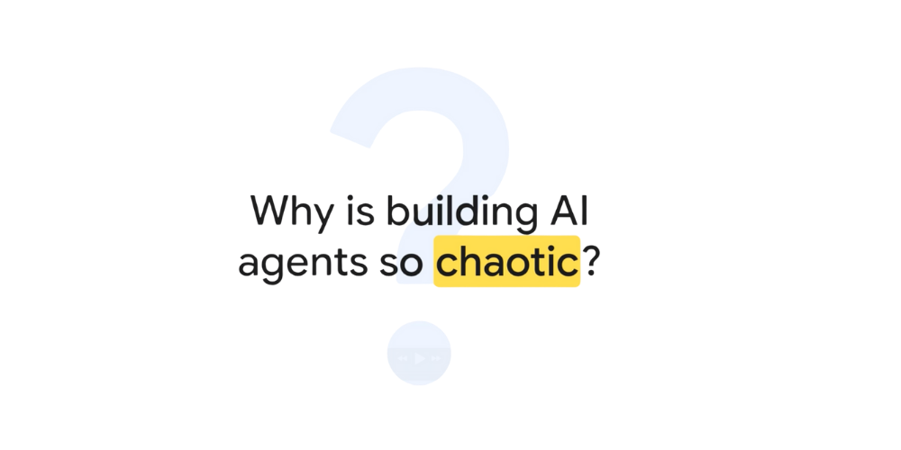

Before MCP, every AI app needed a custom integration for every tool: `n` apps × `m` tools = `n × m` brittle one-off connections. Teams inside the same company would reinvent the same Slack/GitHub/Postgres integration over and over.

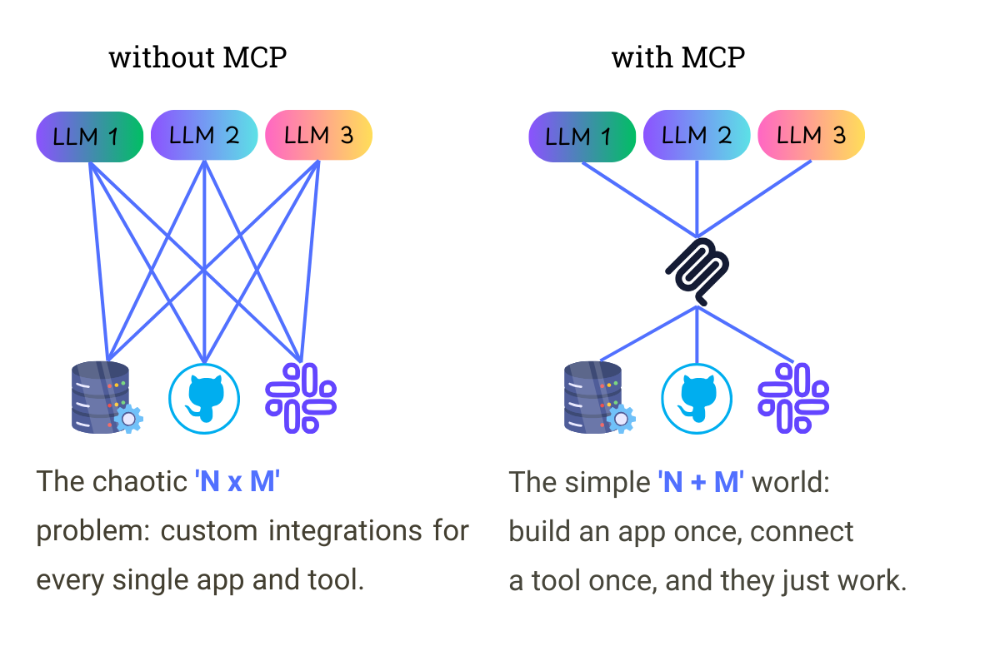

MCP collapses this to **N + M**: each app implements MCP once, each tool exposes MCP once, and any combination works together. Same pattern Web APIs gave us for app-to-server and LSP gave us for editor-to-language tooling.

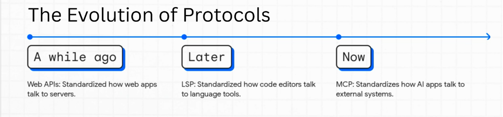

#### Three pillars

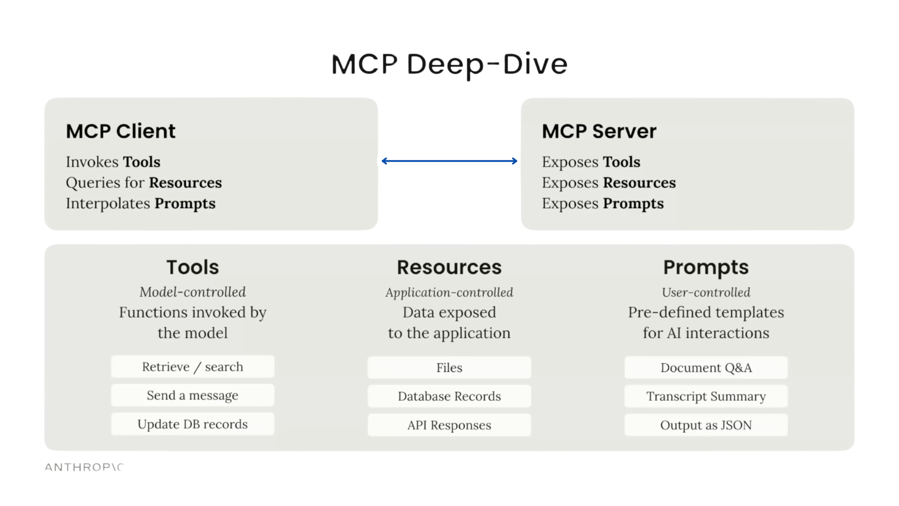

Each pillar makes ownership explicit, so it's always clear who's driving:

| Pillar | Controlled by | Purpose |
|---|---|---|
| **Tools** | The model | Lets the AI take actions — query a DB, call an API, write a file |
| **Resources** | The application | Feeds the AI structured context — files, error logs, JSON objects |
| **Prompts** | The user | Slash-command shortcuts that kick off multi-step workflows |

#### The MCP Registry & self-discovering agents

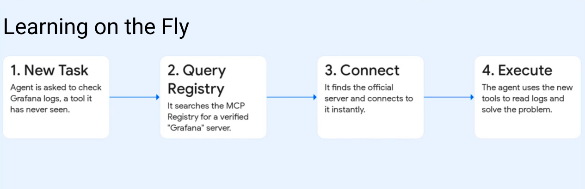

The [official MCP Registry](https://registry.modelcontextprotocol.io/) (public preview since September 2025) is the app-store-equivalent for MCP servers. An agent that needs to check Grafana logs but doesn't have a Grafana tool wired up can ping the registry, find the verified server, install it, and continue — teaching itself a new capability on the fly.

#### The MCP ecosystem today

- **Vendor-neutral governance** — MCP was donated to the [Agentic AI Foundation](https://www.anthropic.com/news/donating-the-model-context-protocol-and-establishing-of-the-agentic-ai-foundation) (a Linux Foundation directed fund) in December 2025, alongside Block's goose and OpenAI's AGENTS.md.
- **Registry** — search official and community servers at [registry.modelcontextprotocol.io](https://registry.modelcontextprotocol.io/) (still officially in preview).
- **MCP Apps** — the first official MCP extension (January 2026): servers can ship interactive UI components in sandboxed iframes, not just text tools.
- **Spec cadence** — current ratified spec is 2025-11-25; the [2026-07-28 release candidate](https://blog.modelcontextprotocol.io/posts/2026-07-28-release-candidate/) (stateless core, official extensions) is the largest revision since launch.
- **Scale** — 97M+ monthly SDK downloads and ~10,000 active servers as of December 2025.

```bash
claude mcp add <server> npx '@<package>@latest'   # install a server
claude mcp login <server>                          # OAuth sign-in (v2.1.186+)
/mcp                                               # list connected servers
```

📚 References: [MCP roadmap](https://modelcontextprotocol.io/development/roadmap) · [Official servers](https://github.com/modelcontextprotocol/servers).

---

<a id="fast-mode"></a>
### Fast Mode ↯

`/fast` toggles fast mode — up to **2.5× faster output at 2× the price**, running on **Opus 4.8** (the default fast-mode model since v2.1.154). CLI-only, requires v2.1.36+. The **↯** indicator confirms it's on. On subscription plans, fast mode draws from usage credits rather than plan limits.

| | Standard Opus 4.8 | Fast Mode (Opus 4.8) |
|---|---|---|
| Input (per MTok) | $5 | $10 (2×) |
| Output (per MTok) | $25 | $50 (2×) |

> ⚠️ **Fast mode on older Opus models is going away.** Opus 4.7 fast ($30/$150) was deprecated June 25 and is **removed on July 24, 2026**; Opus 4.6 has silently run at standard speed since June 29. Don't build workflows on either.

```bash
/fast                                    # toggle on (↯ appears)
> fix the auth bug in src/login.ts       # faster output
/fast                                    # toggle off when done
```

**Decision rule:** use it when latency matters (live debugging, demo prep, time-pressured fixes). At 2× cost it's a much easier call than the old 6× — but background work still doesn't need it. Use `/usage` to monitor.

---

### Super Claude Framework

> An open-source framework that bolts pre-built personas, commands, and workflows on top of Claude Code.

**What it is.** [Super Claude](https://github.com/SuperClaude-Org/SuperClaude_Framework) ships 15+ ready-made specialist agents (architect, security, performance, frontend, etc.) plus a library of structured slash commands (`/sc:analyze`, `/sc:improve`, `/sc:design`) and behavioral flags. It installs into `~/.claude/` as a drop-in extension to Claude Code.

**Why pair it with Claude Code.** Skips the "write your own role prompts" phase. You get a curated library of expert personas and commands the community has already iterated on — useful as both a daily tool and a reference for how to write your own skills.

**When to reach for it.** You want pre-built specialist agents without building them yourself, or you're learning prompt patterns by reading well-crafted examples.

→ [Source on GitHub](https://github.com/SuperClaude-Org/SuperClaude_Framework)

---

### The BMAD METHOD — AI Agent Framework

> A multi-agent framework that walks a project from idea to working software using a team of Claude agents in defined roles.

**What it is.** [BMAD](https://github.com/bmad-code-org/BMAD-METHOD) (Breakthrough Method of Agile AI-driven Development) coordinates specialist agents — analyst, PM, architect, developer, QA, scrum master — through a full SDLC. Each role produces specific artifacts (PRD, architecture doc, story file) that the next role consumes. Works as a Claude Code extension via skills and agents.

**Why pair it with Claude Code.** Gives you a documented, repeatable workflow for greenfield builds. Instead of asking Claude "build me an app," you walk through analyst → PM → architect → developer → QA, each agent producing structured output the next one consumes.

**When to reach for it.** Greenfield projects, large feature builds, or any time you want planning rigor before code. Overkill for a quick fix or a one-file refactor.

→ [Source on GitHub](https://github.com/bmad-code-org/BMAD-METHOD)

---

### FAQ

*[→ Full FAQ in `docs/reference/faq.md`](docs/reference/faq.md)* — covers models, pricing, tokens, plans, Fast Mode, worktrees, and Pro-plan optimization.

A few of the most-asked questions:

**How many messages do I get on the Pro plan?**
Anthropic no longer publishes exact counts — third-party estimates put Pro at roughly ~45 messages per 5-hour window, and Claude Code's five-hour rate limits were **doubled on May 6, 2026** ([announcement](https://www.anthropic.com/news/higher-limits-spacex)). [Details →](docs/reference/faq.md#q-how-many-messages-do-i-get-on-the-pro-plan)

**What's the difference between Pro, Max 5x, and Max 20x?**
Pro $20/mo, Max 5x from $100/mo (5× usage), Max 20x $200/mo (20× usage). All paid tiers include Claude Code and the current lineup — Fable 5 draws usage credits rather than plan limits. [Pricing details →](docs/reference/faq.md#q-what-are-the-claude-subscription-plans)

**Should I use Fast Mode?**
It now runs on Opus 4.8 at 2× price for up to 2.5× output speed — an easy call when latency matters. [More →](docs/reference/faq.md#q-what-is-fast-mode-and-when-should-i-use-it)

**What's the difference between custom slash commands and skills?**
Officially one system now — `.claude/commands/deploy.md` and `.claude/skills/deploy/SKILL.md` both create `/deploy`. See [Skills FAQ in `docs/skills.md`](docs/skills.md#skills-faq).

**Can I use the 1M-token context window?**
Yes — 1M context is standard on Sonnet 5, Opus 4.8, and Fable 5, with no long-context surcharge. [More →](docs/reference/faq.md#q-can-i-use-the-1m-context-window)

---

<a id="updates--deprecations-february-2026"></a>
<a id="updates--deprecations"></a>

### Updates & Deprecations (as of July 2026)

*[→ Full changelog in `docs/reference/changelog.md`](docs/reference/changelog.md)* — major changes, new features, and deprecations through early July 2026 (Claude Code v2.1.201).

**Recent highlights:**

- 🆕 **Claude Sonnet 5** *(June 30, 2026)* — Claude Code's new default model; 1M-token context standard.
- 🆕 **Claude Opus 4.8** *(May 28, 2026)* — Opus flagship at unchanged pricing; **Claude Fable 5 / Mythos 5** *(June 9, 2026)* opened the Mythos-class tier above Opus.
- 🆕 **Dynamic workflows + `ultracode`** — Claude orchestrates tens to hundreds of background subagents; watch with `/workflows`.
- 🆕 **Artifacts** *(beta)* — publish live web pages to claude.ai from the CLI.
- 🆕 **v2.1.198** *(July 1, 2026)* — Claude in Chrome GA, subagents run in the background by default, `/agents` wizard removed.
- 📝 **Renames** — `/cost` + `/stats` → `/usage`; `/extra-usage` → `/usage-credits`; permission mode "default" → "Manual" (v2.1.200); `/simplify` → `/code-review` (then reintroduced as a cleanup-only review).
- 📝 **Limits** — five-hour rate limits doubled for Pro/Max/Team on May 6, 2026.
- ❌ **Deprecations** — Opus 4.1 retires Aug 5, 2026; Opus 4.7 fast mode removed July 24, 2026.

> 💡 For Anthropic's authoritative release notes, see the [Claude Code CHANGELOG](https://github.com/anthropics/claude-code/blob/main/CHANGELOG.md) and the [weekly "What's new" digests](https://code.claude.com/docs/en/whats-new/).

---

### 📖 Reading tips

- **Reading on GitHub?** The in-page anchor links work natively. Tap the table-of-contents button (top-left of the file view) for fast jumping.
- **Want a richer markdown view?** This repo plays well with [Obsidian](https://obsidian.md/) — handy if you also want to open the `specialized-agents/agent-orchestration-workflow.canvas` flowchart.
- **On a phone?** Stick to the [Choose your path](#-choose-your-path) section at the top; the wider tables read best on desktop.

---

### References

*[→ Full reading list in `docs/reference/further-reading.md`](docs/reference/further-reading.md)*

A curated set of pointers — official Anthropic docs, MCP resources, hooks examples, workflow tutorials, pricing references, and adjacent tooling.

**Most-clicked starting points:**

- [Claude Code overview (official)](https://code.claude.com/docs/en/overview)
- [Claude Code best practices (official)](https://code.claude.com/docs/en/best-practices)
- [Building effective agents (Anthropic engineering)](https://www.anthropic.com/engineering/building-effective-agents)
- [Official MCP Registry](https://registry.modelcontextprotocol.io/)
- [Hooks reference (official)](https://code.claude.com/docs/en/hooks)

---

> Features, pricing, and availability change frequently. Always check the [official Claude Code documentation](https://code.claude.com/docs/en/overview) for the most current information.

*Last reviewed July 2026 · Spotted something stale? [Open an issue](https://github.com/wesammustafa/Claude-Code-Everything-You-Need-to-Know/issues) or send a PR — see [`CONTRIBUTING.md`](CONTRIBUTING.md).*
