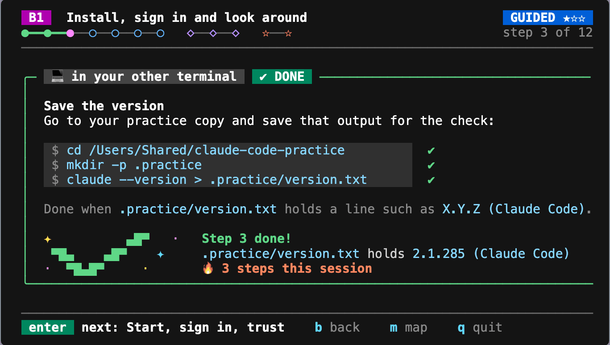
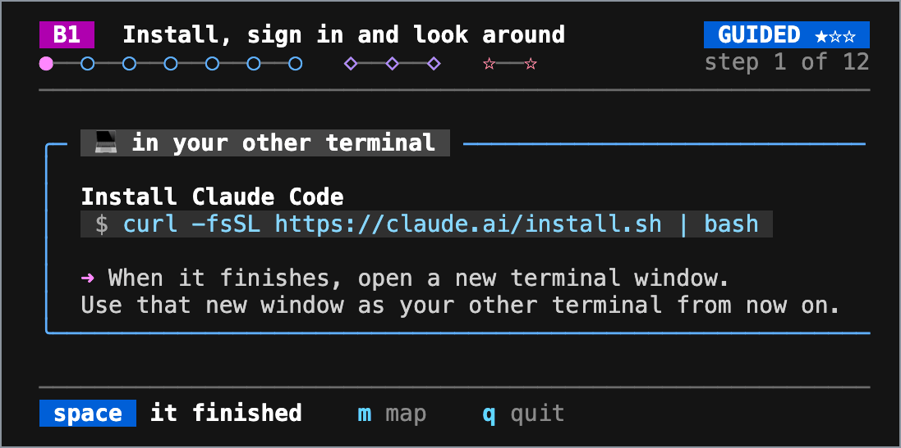
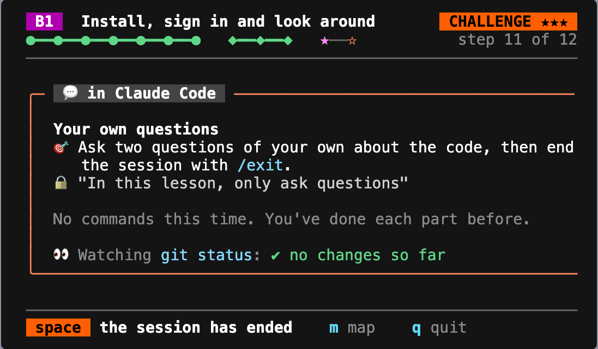

# Claude Code: Everything You Need to Know 

**Learn Claude Code in three levels, from your first session to unattended multi-agent runs.**

You learn by doing: every core lesson and capstone ends with a check you run in your own practice copy, and Beginner lesson 1 runs step by step in a terminal app beside Claude Code.\
**[Try it now](#try-it-now)** · [Pick your level](#pick-your-level) · [Every page](#everything-in-the-guide)

An independent community guide. Not affiliated with or endorsed by Anthropic.

[](CHANGELOG.md#v202610---2026-10-05) [](https://github.com/wesammustafa/Claude-Code-Everything-You-Need-to-Know/releases/latest) [](LICENSE) [](https://github.com/hesreallyhim/awesome-claude-code)

<p align="center">
  
  <br />
  <sub>The learning app, <code>npm run learn</code>, at Beginner lesson 1, step 3: you type in your other terminal, and the step turns green by itself. Claude Code v2.1.285 (stable), 2026-10-10.</sub>
</p>

<details>
<summary>The same screen as text</summary>

```text
B1  Install, sign in and look around                 GUIDED   step 3 of 12

in your other terminal   ✔ DONE

Save the version
Go to your practice copy and save that output for the check:

  $ cd /Users/Shared/claude-code-practice           ✔
  $ mkdir -p .practice                              ✔
  $ claude --version > .practice/version.txt        ✔

Done when .practice/version.txt holds a line such as X.Y.Z (Claude Code).

Step 3 done!
.practice/version.txt holds 2.1.285 (Claude Code)
3 steps this session

enter  next: Start, sign in, trust    b back    m map    q quit
```

</details>

## Try it now

1. Make your practice copy: open [claude-code-practice](https://github.com/wesammustafa/claude-code-practice), select **Use this template** > **Create a new repository**, and clone your copy. Or open your copy in a Codespace, where Node.js and Claude Code come preinstalled.
2. In your copy, start the app. It needs Node.js LTS and git, and there is nothing to install with npm:

   ```bash
   npm run learn
   ```

3. Open a second terminal in the same folder. The app tells you what to type there, starting with installing Claude Code, and checks your work as you go:

   ```text
   this window                     your other terminal
   npm run learn                   where you type commands
   one step at a time,     --->    and run Claude Code
   checks your work                (this app checks it)
   ```

The app teaches Beginner lesson 1 step by step; for the other Beginner lessons, it watches the lesson's check while you follow the page. It has no AI in it and changes none of your work: it reads your files, runs `git status` and the lesson's check, and writes only its own file.

Prefer to read? Every lesson works from its page alone. Each core lesson ends with a check you run from your practice copy, for example `npm run check -- b-1`: each item prints `PASS` or `FAIL`, with a hint for what to fix.

## Help that fades as you learn

The help shrinks as you get better: GUIDED shows every command, HINTED gives the goal and a hint each time you press `h`, and CHALLENGE gives just the goal.

<table>
  <tr>
    <td width="50%" valign="top"></td>
    <td width="50%" valign="top"></td>
  </tr>
  <tr>
    <td><b>Step 1 of 12, GUIDED:</b> the exact command, and the window to type it in.</td>
    <td><b>Step 11 of 12, CHALLENGE:</b> the goal alone, while the app watches your copy.</td>
  </tr>
</table>

<sub>Beginner lesson 1, steps 1 and 11. Claude Code v2.1.285 (stable), 2026-10-10.</sub>

<a id="-choose-your-path"></a>
## Pick your level

### Beginner
**For you if** you're new to Claude Code and comfortable with a terminal and git.\
You'll take one change from request to commit, safely, and give your project a memory. About 2½ hours: 5 lessons, a capstone and 3 Electives.\
**[Start Beginner](docs/beginner/README.md)**

### Intermediate
**Ready if** you can plan a change in plan mode, review the diff and commit it, and keep a long session on track.\
You'll shape Claude Code to your project with skills, hooks, subagents, MCP and plugins. About 3 hours: 8 lessons, a capstone and 4 Electives.\
**[Start Intermediate](docs/intermediate/README.md)**

### Advanced
**Ready if** you can write a project skill, enforce a rule with a hook, delegate to a subagent and connect an MCP server.\
You'll run Claude Code in parallel, unattended in CI, and for a team, within limits you set. About 3 hours 20 minutes, plus run time: 7 lessons, a capstone and 5 Electives.\
**[Start Advanced](docs/advanced/README.md)**

## Install

```bash
curl -fsSL https://claude.ai/install.sh | bash
```

macOS, Linux and WSL. For Windows and other installers, see the [official setup page](https://code.claude.com/docs/en/setup). Claude Code needs a paid Claude plan (Pro, Max, Team or Enterprise), a Claude Console account, or a supported cloud provider ([Quickstart](https://code.claude.com/docs/en/quickstart)).

## How the guide stays current

- Every lesson page carries a Stamp: the Claude Code `stable` version its claims were checked against, and the date ([The stamp](CONTRIBUTING.md#the-stamp)).
- The checks are tested too: in the practice template, CI shows every check failing on its `main` branch, where no exercise is done, and passing on its reference solutions ([Assert checks](https://github.com/wesammustafa/claude-code-practice/blob/main/.github/workflows/assert-checks.yml)).
- Scheduled checks keep watch between editions: external links and new `stable` releases weekly, expiry markers daily, and the app's quotes of the lessons weekly. Each opens a tracking issue ([Maintainer routine](CONTRIBUTING.md#maintainer-routine)).
- The examples are inert until you copy them into a project, and they follow a [safety contract](CONTRIBUTING.md#adding-a-skill): local only (apart from the MCP lesson's pinned server), least privilege, and a smoke test that runs without Claude.

<a id="-whats-inside"></a><a id="-reading-tips"></a>
## Everything in the guide

<details>
<summary>Every page, by level</summary>

**Beginner:** [Level index](docs/beginner/README.md) · [Install, sign in and look around](docs/beginner/01-install-and-look-around.md) · [Permission modes and plan mode](docs/beginner/02-permission-modes-and-plan-mode.md) · [Your first change, from request to commit](docs/beginner/03-first-change.md) · [Keep a session on track](docs/beginner/04-keep-a-session-on-track.md) · [Project memory with CLAUDE.md](docs/beginner/05-project-memory.md) · [Capstone](docs/beginner/capstone.md)

**Beginner Electives:** [IDE extensions](docs/beginner/electives/ide-extensions.md) · [Screenshots and images](docs/beginner/electives/screenshots-and-images.md) · [The built-in teachers](docs/beginner/electives/built-in-teachers.md)

**Intermediate:** [Level index](docs/intermediate/README.md) · [Turn a repeated workflow into a skill](docs/intermediate/01-first-skill.md) · [Organize project memory and see what loaded](docs/intermediate/02-organize-memory.md) · [Pick the model and effort](docs/intermediate/03-model-and-effort.md) · [Permissions, settings scopes and the sandbox](docs/intermediate/04-permissions-and-sandbox.md) · [Enforce a rule with a hook](docs/intermediate/05-hooks.md) · [Delegate to a custom subagent](docs/intermediate/06-subagents.md) · [Connect a tool with MCP](docs/intermediate/07-mcp.md) · [Install and manage plugins](docs/intermediate/08-plugins.md) · [Capstone](docs/intermediate/capstone.md)

**Intermediate Electives:** [Skill patterns](docs/intermediate/electives/skill-patterns.md) · [Claude in Chrome](docs/intermediate/electives/claude-in-chrome.md) · [The status line](docs/intermediate/electives/status-line.md) · [Fast mode](docs/intermediate/electives/fast-mode.md)

**Advanced:** [Level index](docs/advanced/README.md) · [Parallel sessions with worktrees](docs/advanced/01-parallel-sessions.md) · [Choose an orchestration pattern](docs/advanced/02-orchestration-patterns.md) · [Run and save a dynamic workflow](docs/advanced/03-dynamic-workflows.md) · [Script Claude Code with `claude -p`](docs/advanced/04-headless.md) · [GitHub Actions](docs/advanced/05-github-actions.md) · [Share your setup with a team](docs/advanced/06-share-your-setup.md) · [Put bounds on autonomous runs](docs/advanced/07-bounded-runs.md) · [Capstone](docs/advanced/capstone.md) · [Beyond this guide](docs/advanced/beyond-this-guide.md)

**Advanced Electives:** [Agent teams](docs/advanced/electives/agent-teams.md) · [Agent view](docs/advanced/electives/agent-view.md) · [`/goal`, `/loop` and routines](docs/advanced/electives/goal-loop-routines.md) · [Testing and publishing a plugin](docs/advanced/electives/publish-a-plugin.md) · [Dev containers](docs/advanced/electives/dev-containers.md)

**Topics:** [All topics](docs/topics/README.md) · [Permissions and safety](docs/topics/permissions-and-safety.md) · [Memory and context](docs/topics/memory-and-context.md) · [Models, effort and cost](docs/topics/models-effort-and-cost.md) · [Skills](docs/topics/skills.md) · [Hooks](docs/topics/hooks.md) · [Subagents and parallel work](docs/topics/subagents-and-parallel-work.md) · [MCP](docs/topics/mcp.md) · [Plugins](docs/topics/plugins.md) · [Automation](docs/topics/automation.md)

**Reference:** [Reference index](docs/reference/README.md) · [Models and effort](docs/reference/models.md) · [Commands by level](docs/reference/commands.md) · [Feature map](docs/reference/feature-map.md) · [Further learning](docs/reference/further-reading.md) · [Glossary](docs/reference/glossary.md) · [Changelog](docs/reference/changelog.md)

**Examples:** [How to use the examples](examples/README.md)

</details>

---

Found something stale? [Report it with a source](https://github.com/wesammustafa/Claude-Code-Everything-You-Need-to-Know/issues/new?template=stale-content.yml). Stuck on a lesson? Use the link at the bottom of that lesson. Claude Code is a product of Anthropic.

If the guide helped you, a star helps other learners find it.

[MIT License](LICENSE) · [Contributing](CONTRIBUTING.md) · [Changelog](CHANGELOG.md) · [Security](SECURITY.md)

*Mascot: [`assets/brand/claude-jumping.svg`](assets/brand/claude-jumping.svg) comes from [shanraisshan/claude-code-best-practice](https://github.com/shanraisshan/claude-code-best-practice), Copyright (c) 2025-2026 Shayan Rais, used under the [MIT License](https://github.com/shanraisshan/claude-code-best-practice/blob/main/LICENSE).*

### Links from the previous edition

The previous edition's README sections moved. If a link brought you here, find its section below:

- <a id="sdlc"></a><a id="what-are-llms-and-how-do-they-differ-from-ai-tools-like-claude-code"></a><a id="what-is-claude-code"></a><a id="claude-code-setup"></a><a id="1-install"></a><a id="2-authenticate"></a><a id="3-run-your-first-prompt"></a>Moved to [Install, sign in and look around](docs/beginner/01-install-and-look-around.md).
- <a id="prompt-engineering-deep-dive"></a><a id="1-explore--plan--code--commit"></a><a id="2-test-driven-workflow-write-tests--code--commit"></a>Moved to [Your first change, from request to commit](docs/beginner/03-first-change.md).
- <a id="4-optional-generate-a-claudemd"></a>Moved to [Project memory with CLAUDE.md](docs/beginner/05-project-memory.md).
- <a id="3-visual-iteration-code--screenshot--iterate--commit"></a>Moved to [Give Claude a screenshot](docs/beginner/electives/screenshots-and-images.md).
- <a id="claude-opus-46-the-latest-powerhouse"></a><a id="claude-opus-47-the-latest-flagship"></a><a id="the-claude-5-era-todays-model-lineup"></a>Moved to [Models and effort](docs/reference/models.md).
- <a id="effort-levels"></a><a id="4-effort-levels--how-hard-claude-thinks"></a>Moved to [Pick the model and effort](docs/intermediate/03-model-and-effort.md).
- <a id="claude-commands"></a><a id="built-in-slash-commands"></a><a id="day-1-essentials"></a>Moved to [Commands by level](docs/reference/commands.md).
- <a id="custom-slash-commands"></a><a id="claude-skills"></a><a id="your-first-skill-in-3-minutes"></a><a id="want-more-depth"></a><a id="what-are-skills"></a><a id="built-in-vs-custom-skills"></a><a id="skills-faq"></a><a id="creating-custom-skills"></a>Moved to [Turn a repeated workflow into a skill](docs/intermediate/01-first-skill.md).
- <a id="available-skills-reference"></a><a id="using-skills-in-workflow"></a>Moved to [Turn a repeated workflow into a skill](docs/intermediate/01-first-skill.md), which shows how to run a skill. The catalog of this repo's own skills and its workflow recipes were removed in edition v2026.10: see the [CHANGELOG](CHANGELOG.md#removed-live-config).
- <a id="troubleshooting-skills"></a><a id="skills-best-practices"></a>Moved to [Skill patterns](docs/intermediate/electives/skill-patterns.md).
- <a id="hooks"></a><a id="setting-up-claude-hooks"></a><a id="setting-up-hooks"></a><a id="hook-events"></a><a id="hook-input"></a><a id="hook-output"></a><a id="security-considerations"></a><a id="hook-execution-details-and-debugging"></a><a id="execution--debugging"></a>Moved to [Enforce a rule with a hook](docs/intermediate/05-hooks.md).
- <a id="2-general-purpose-subagents--when-one-claude-isnt-enough"></a><a id="3-specialized-subagents--drop-in-role-prompts"></a>Moved to [Delegate to a custom subagent](docs/intermediate/06-subagents.md). The drop-in role prompts were removed in edition v2026.10: see the [CHANGELOG](CHANGELOG.md#removed-listings).
- <a id="ai-agents"></a><a id="running-agents-in-parallel"></a><a id="subagents--running-agents-in-parallel"></a><a id="orchestrating-specialists-from-the-main-session"></a>Moved to [Choose an orchestration pattern](docs/advanced/02-orchestration-patterns.md).
- <a id="1-git-worktrees--parallel-branches-parallel-sessions"></a>Moved to [Parallel sessions with worktrees](docs/advanced/01-parallel-sessions.md).
- <a id="agent-teams-experimental---2026"></a><a id="agent-teams-experimental"></a><a id="enable-it"></a><a id="the-example-that-justifies-the-cost"></a><a id="staff-a-team-with-the-role-prompts-you-already-have"></a><a id="three-things-that-catch-people-out"></a><a id="monitoring-and-the-naming-trap"></a><a id="best-practices"></a>Moved to [Agent teams](docs/advanced/electives/agent-teams.md).
- <a id="dynamic-workflows"></a><a id="try-it-in-2-minutes--no-script-required"></a><a id="starting-your-own"></a>Moved to [Run and save a dynamic workflow](docs/advanced/03-dynamic-workflows.md).
- <a id="beyond-one-terminal--the-2026-automation-surface"></a>Moved to [Feature map](docs/reference/feature-map.md).
- <a id="model-context-protocol-mcp"></a><a id="the-nm-problem-mcp-solves"></a><a id="three-pillars"></a><a id="the-mcp-registry--self-discovering-agents"></a><a id="the-mcp-ecosystem-today"></a>Moved to [Connect a tool with MCP](docs/intermediate/07-mcp.md).
- <a id="fast-mode"></a><a id="fast-mode-"></a>Moved to [Fast mode](docs/intermediate/electives/fast-mode.md).
- <a id="beyond-your-own-skills--the-ecosystem"></a>Moved to [Install and manage plugins](docs/intermediate/08-plugins.md). The skills ecosystem catalog was removed in edition v2026.10: see the [CHANGELOG](CHANGELOG.md#removed-listings).
- <a id="featured-mcp-servers"></a><a id="more-mcp-servers-worth-knowing"></a>Moved to [Connect a tool with MCP](docs/intermediate/07-mcp.md). The MCP server tables were removed in edition v2026.10: see the [CHANGELOG](CHANGELOG.md#removed-listings).
- <a id="super-claude-framework"></a><a id="the-bmad-method--ai-agent-framework"></a>Removed in edition v2026.10: listings no lesson uses. See the [CHANGELOG](CHANGELOG.md#removed-listings).
- <a id="updates--deprecations-february-2026"></a><a id="updates--deprecations"></a><a id="updates--deprecations-as-of-july-2026"></a>Removed in edition v2026.10: the guide's summaries of Claude Code releases. See the [CHANGELOG](CHANGELOG.md#removed-changelog-mirror).
- <a id="faq"></a>Moved to [FAQ](docs/reference/faq.md), which says where each answer went.
- <a id="references"></a>Moved to [Further learning](docs/reference/further-reading.md).
- <a id="steal-this-setup"></a><a id="5-bonus-steal-this-repos-setup"></a>Moved to [Share your setup with a team](docs/advanced/06-share-your-setup.md).
- <a id="-when-to-use-what"></a>Moved to [When to use what](docs/intermediate/README.md#when-to-use-what).

