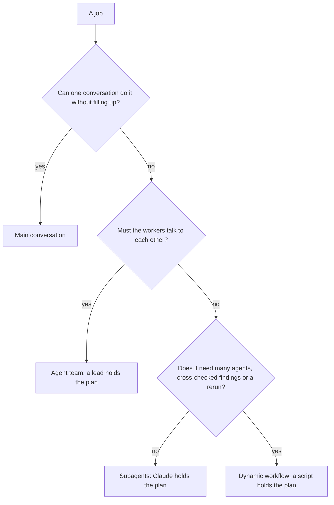

# Choose an orchestration pattern

<sub>**Advanced** · Lesson 2 of 7 · about 20 minutes · Needs: [Parallel sessions with worktrees](01-parallel-sessions.md) · Verified against Claude Code v2.1.285 (stable) on 2026-10-09</sub>

## Goal

By the end of this lesson you can choose between the main conversation, subagents, a dynamic workflow and an agent team by what a job needs and what it costs, and run a job as parallel subagents.

## You need

- Your repository from [lesson 1](01-parallel-sessions.md), with at least three top-level folders that hold files, and your copy of the practice template with Node.js LTS: the check runs from the copy. Set up the repository's `.practice/` folder as [Beginner lesson 1](../beginner/01-install-and-look-around.md#you-need) describes, if you haven't yet.
- macOS, Linux or WSL 2, and `jq`: the delegation log in Your turn is a shell command that uses it.
- Usage: moderate. Each subagent works in its own context window and sends its own requests, which count toward the same usage limits as your main conversation ([Create custom subagents](https://code.claude.com/docs/en/sub-agents)). For a lighter run, use two folders in the Worked example and two files in job 1.

## The idea

Subagents, a dynamic workflow and an agent team all split a job across workers; what differs is who holds the plan ([When to use a workflow](https://code.claude.com/docs/en/workflows#when-to-use-a-workflow)). With subagents, Claude decides turn by turn, and each result comes back into your conversation. A dynamic workflow is a script Claude writes: it holds the loop and the intermediate results, so it can run many agents, cross-check their findings and rerun the same way. In an agent team, a lead supervises teammates who message each other directly ([Choose an approach](https://code.claude.com/docs/en/agents#choose-an-approach)).

Every pattern past one conversation adds usage: each subagent, and each agent a workflow spawns, sends requests of its own ([Why usage climbs](https://code.claude.com/docs/en/costs#why-usage-climbs-in-a-long-session)), and agent teams "use significantly more tokens than a single session" ([When to use agent teams](https://code.claude.com/docs/en/agent-teams#when-to-use-agent-teams)). So pick the cheapest pattern the job needs: ask these questions in order, and stop at the first answer that settles it.



> [!NOTE]
> "Agent teams are experimental and disabled by default." ([Orchestrate teams of Claude Code sessions](https://code.claude.com/docs/en/agent-teams)) This lesson names them as one option and doesn't run one; the [Agent teams](electives/agent-teams.md) Elective does.

## Worked example

1. Pick three top-level folders in your repository, such as `src`, `test` and `docs`, and start `claude`.
2. Ask the chart's questions about one job: a newcomer's summary of each folder. One conversation would fill with file reads it won't need again, so not the main conversation ([Choose between subagents and main conversation](https://code.claude.com/docs/en/sub-agents#choose-between-subagents-and-main-conversation)). The summaries needn't talk to each other, so no team. It's three tasks, done once, so subagents.
3. Ask for them, with your own folder names, as the docs' parallel research example does ([Run parallel research](https://code.claude.com/docs/en/sub-agents#run-parallel-research)):

   ```text
   Research the src, test and docs folders in parallel using separate subagents, and give me two sentences on each.
   ```

   By default, an interactive session runs subagents in the background, so your prompt stays free ([Run subagents in foreground or background](https://code.claude.com/docs/en/sub-agents#run-subagents-in-foreground-or-background)). The panel below the prompt shows a row for each one while it works.
4. While they work, run `/tasks`. It lists each subagent with its state and the model it runs on; press Enter on a row to open its transcript ([Check on running work](https://code.claude.com/docs/en/agents#check-on-running-work), [Choose a model](https://code.claude.com/docs/en/sub-agents#choose-a-model)). Claude may start [built-in](https://code.claude.com/docs/en/sub-agents#built-in-subagents) `Explore` or `general-purpose` subagents, or forks of your conversation, so your rows will differ. When one finishes successfully, its row leaves the panel and the footer briefly shows `/tasks to see subagents`; the row of one that fails stays for a moment.
5. When the summaries arrive, run `/usage`. On a Pro, Max, Team or Enterprise plan, its usage breakdown attributes your recent usage to skills, subagents, plugins and MCP servers, and flags behaviors, such as long context, that account for a notable share of it ([Plan usage breakdown](https://code.claude.com/docs/en/costs#plan-usage-breakdown)). Its Session block, intended for API users such as those signed in with a Console account, shows this session's estimated cost ([Using the `/usage` command](https://code.claude.com/docs/en/costs#using-the-%2Fusage-command)). Both are estimates.
6. Name what would change the answer. The same summary for every folder, cross-checked and rerun before each release, would be a workflow, the next lesson's pattern. Reviewers who must argue a root cause out between themselves would be an agent team.

## Your turn

**Brief:** here are four jobs for your repository. Choose a pattern for each by what it needs and what it costs, write your choices down, then run the one that calls for subagents.

1. Check the three largest source files for errors that are caught and ignored. Reading the files in your conversation would crowd it, and you only need the findings: one reviewer per file, once, and one short list back.
2. Run the same check on every source file, verify each finding against the code before it's reported, and rerun it before every release.
3. Fix a typo in one error message.
4. Three investigators each test a different theory for a flaky test, message each other as they work to challenge each other's findings, and keep going until they agree on a cause.

**Acceptance criteria:**

- `.practice/a-2-choices.md` has one line per job, `<job number>: <pattern> because <reason>`, and each pattern is `main conversation`, `subagents`, `workflow` or `agent team`.
- `.practice/a-2-hook.json` holds this [`SubagentStart` hook](https://code.claude.com/docs/en/hooks#subagentstart), which appends each subagent's id and type to `.practice/a-2-agents.txt` when it starts, like the delegation log in [Delegate to a custom subagent](../intermediate/06-subagents.md):

  ```json
  {
    "hooks": {
      "SubagentStart": [
        { "hooks": [ { "type": "command", "command": "jq -r '[.agent_id, .agent_type] | @tsv' >> \"$CLAUDE_PROJECT_DIR/.practice/a-2-agents.txt\"" } ] }
      ]
    }
  }
  ```

- Job 1 ran as parallel subagents, one per file, in a session you started with `claude --settings .practice/a-2-hook.json` ([CLI reference](https://code.claude.com/docs/en/cli-reference#cli-flags)).
- Job 1 changed no file: the reviewers only report, and `git status` shows no change from them.
- Only job 1 ran. The other three are choices.

## Check

You are done when all of these are true:

- [ ] `.practice/a-2-choices.md` picks the cheapest pattern that fits each job.
- [ ] `.practice/a-2-agents.txt` shows at least two subagents starting for job 1: `cut -f1 .practice/a-2-agents.txt | sort -u` lists two or more ids.
- [ ] Self-check (not tested): for one real job from your own backlog, you can name its pattern, the question that decided it, and why a cheaper pattern wouldn't do.

Run `npm run check -- a-2 --dir <your repo>` from your practice copy.

If a job's pattern is wrong, ask the chart's questions in order: the check's hint names the question that settles that job. If the log has fewer than two ids, start the session with the hook file and ask for one subagent per file, in parallel. A subagent that Claude resumes logs its id again, so it counts once.

## Watch out

- A background subagent's permission prompts appear in your main session, and an answer that lasts beyond that one tool call, such as a grant for the rest of the session, applies to the whole session, your main conversation included ([Run subagents in foreground or background](https://code.claude.com/docs/en/sub-agents#run-subagents-in-foreground-or-background)). Approve each of those prompts for that one call only, never for the rest of the session, and ask reviewers only to read.
- Each subagent's result returns to your conversation, and each subagent spends tokens of its own while it runs, so many detailed results crowd your context and add to your usage. Ask for short results ([Run parallel research](https://code.claude.com/docs/en/sub-agents#run-parallel-research)).
- With agent teams turned on, a subagent that Claude names launches as a teammate, so a team can form when you asked for subagents. The hook also logs a line each time a teammate that runs inside your main terminal handles a new message ([Claude spawns teammates instead of subagents](https://code.claude.com/docs/en/agent-teams#claude-spawns-teammates-instead-of-subagents), [SubagentStart](https://code.claude.com/docs/en/hooks#subagentstart)). If you turned teams on, add `"env": { "CLAUDE_CODE_EXPERIMENTAL_AGENT_TEAMS": "0" }` to `.practice/a-2-hook.json`, as a top-level key beside `"hooks"`. A `--settings` file overrides your user, project and local settings and a shell export, and only managed settings override it ([Settings precedence](https://code.claude.com/docs/en/settings#settings-precedence)).

## Go further

- [Run agents in parallel](https://code.claude.com/docs/en/agents): the official comparison of the ways Claude Code works on several tasks at once, and how to check on each.
- [Fork the current conversation](https://code.claude.com/docs/en/sub-agents#fork-the-current-conversation): a subagent that inherits your whole conversation and shares its prompt cache, for a side task that needs the same context.
- [Agent team token costs](https://code.claude.com/docs/en/costs#agent-team-token-costs): what drives a team's usage, and how to keep it small.

---

<sub>Sources: [Run agents in parallel](https://code.claude.com/docs/en/agents) · [Orchestrate subagents at scale with dynamic workflows](https://code.claude.com/docs/en/workflows) · [Orchestrate teams of Claude Code sessions](https://code.claude.com/docs/en/agent-teams) · [Create custom subagents](https://code.claude.com/docs/en/sub-agents) · [Manage costs effectively](https://code.claude.com/docs/en/costs) · [Hooks reference](https://code.claude.com/docs/en/hooks) · [CLI reference](https://code.claude.com/docs/en/cli-reference) · [Settings files and precedence](https://code.claude.com/docs/en/settings)</sub>

<sub>← [Parallel sessions with worktrees](01-parallel-sessions.md) · [Advanced index](README.md) · [Run and save a dynamic workflow](03-dynamic-workflows.md) → · Topic: [Subagents and parallel work](../topics/subagents-and-parallel-work.md) · [Stuck on this lesson?](https://github.com/wesammustafa/Claude-Code-Everything-You-Need-to-Know/issues/new?template=lesson-feedback.yml&lesson=a-2)</sub>
