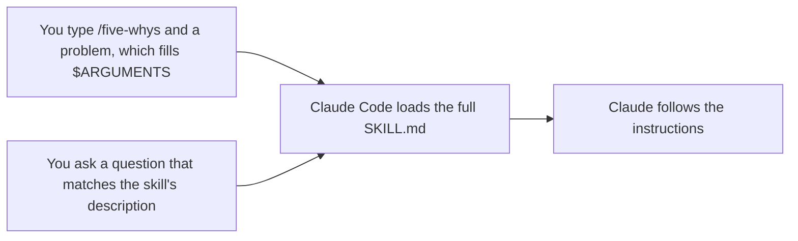

# Turn a repeated workflow into a skill

<sub>**Intermediate** · Lesson 1 of 8 · about 20 minutes · Needs: [Intermediate index](README.md) · Verified against Claude Code v2.1.285 (stable) on 2026-10-06</sub>

## Goal

By the end of this lesson you can turn a workflow you keep repeating into a project skill that runs when you type its name and loads on its own when a request matches it.

## You need

- One of your own repositories with a test command and no uncommitted changes, and your copy of the practice template with Node.js LTS: the check runs from the copy. To practice in the template copy instead, use it for both. Set up the repository's `.practice/` folder as [Beginner lesson 1](../beginner/01-install-and-look-around.md#you-need) describes, if you haven't yet.
- Usage: light to moderate. The Your turn builds one small feature.

> [!NOTE]
> From this level on, the lessons are written for macOS, Linux and WSL 2. On Windows, run Claude Code inside WSL 2 ([Set up on Windows](https://code.claude.com/docs/en/setup#set-up-on-windows)): native Windows has no sandbox, which lesson 4 uses, and the hooks in lesson 5 are bash scripts.

## The idea

A [skill](https://code.claude.com/docs/en/skills) is a folder holding a `SKILL.md` file: YAML frontmatter that says what the skill is for, then the instructions Claude follows. A project skill lives in `.claude/skills/<name>/SKILL.md`. Commit it, and everyone who works in the repository gets it.

Until a skill runs, at most its description sits in Claude's context. It runs in one of two ways, and either way Claude Code then loads the whole file:



- `disable-model-invocation: true` in the frontmatter keeps a skill to the first way. Use it for workflows with side effects, such as a deploy ([Control who invokes a skill](https://code.claude.com/docs/en/skills#control-who-invokes-a-skill)).
- `$ARGUMENTS` in the body receives whatever you type after the skill's name.
- A Markdown file in `.claude/commands/` is the older format and still runs as `/name`. Prefer a skill for new work.

## Worked example

1. In your repository, create the skill's folder and download this guide's example skill, [`five-whys`](../../examples/intermediate/01-first-skill/dot-claude/skills/five-whys/SKILL.md). Read it before you use it:

   ```bash
   mkdir -p .claude/skills/five-whys
   curl -fsSL https://raw.githubusercontent.com/wesammustafa/Claude-Code-Everything-You-Need-to-Know/main/examples/intermediate/01-first-skill/dot-claude/skills/five-whys/SKILL.md -o .claude/skills/five-whys/SKILL.md
   ```

   Leaving out the comment lines at the top of its frontmatter, the file holds:

   ```markdown
   ---
   name: five-whys
   description: Finds the root cause of a bug, failure or recurring problem by asking "why" until the answer is a cause you can fix. Use when the user asks why something keeps happening, or wants the root cause rather than a quick fix.
   argument-hint: "[problem]"
   ---

   Find the root cause of this problem: $ARGUMENTS
   ```

   followed by five numbered steps and the rule "Don't change any files."
2. Start `claude` in the repository and run `/skills` ([Commands](https://code.claude.com/docs/en/commands)). The list includes `five-whys`, marked as a project skill.
3. Run the skill by name, with a problem from your repository. In the practice template:

   ```text
   /five-whys npm run linkcheck -- samples exits with code 1
   ```

   Claude reproduces the problem, asks "why" from evidence until it reaches a cause the team can change, then reports the chain, the root cause and two fixes. Your wording will differ. In a second terminal, `git status` lists only the new `.claude/` folder: the skill told Claude to change nothing.
4. Run `/clear`, then ask a question that matches the description without naming the skill:

   ```text
   Why does the test suite pass even though samples/guide.md has a broken link? I want the root cause, not a quick fix.
   ```

   Before Claude answers, the transcript shows a call to the `Skill` tool for `five-whys`: Claude loaded the skill on its own ([Tools reference](https://code.claude.com/docs/en/tools-reference)).

## Your turn

Finish a partial skill that builds features test-first, then use it both ways.

1. Download the partial [`tdd` skill](../../examples/intermediate/01-first-skill/dot-claude/skills/tdd/SKILL.md):

   ```bash
   mkdir -p .claude/skills/tdd
   curl -fsSL https://raw.githubusercontent.com/wesammustafa/Claude-Code-Everything-You-Need-to-Know/main/examples/intermediate/01-first-skill/dot-claude/skills/tdd/SKILL.md -o .claude/skills/tdd/SKILL.md
   ```

   Its frontmatter has `description: TODO` and `disable-model-invocation: true`, and its steps end like this:

   ```markdown
   2. Green: TODO
   3. Refactor: TODO
   ```

2. In your editor, finish it:
   - replace `TODO` in the description with a sentence or two: what the skill does, and when Claude should use it;
   - delete the `disable-model-invocation: true` line;
   - write the Green and Refactor steps, keeping the Red step's style.
3. Commit the skill: `git add .claude/skills/tdd/SKILL.md`, then `git commit -m "Add a tdd skill"`.
4. In a session, run it by name on a small feature. In the practice template:

   ```text
   /tdd a slugify(heading) function in src/slug.js that turns a Markdown heading into its link anchor: lowercase, punctuation dropped, spaces turned into hyphens
   ```

   Approve its edits and test runs, and let it commit. Then save that commit: `git rev-parse HEAD > .practice/i-1-commit.txt`.
5. Run `/clear` and ask for another small feature test-first, without naming the skill, such as `Add a countHeadings(markdown) function, test-first.` Watch for Claude to run `tdd` through the `Skill` tool on its own. Once you've seen it, you can press `Esc` to stop Claude ([Interactive mode](https://code.claude.com/docs/en/interactive-mode)) and `/rewind` to undo its edits ([Checkpointing](https://code.claude.com/docs/en/checkpointing)), as in [Beginner lesson 4](../beginner/04-keep-a-session-on-track.md).

## Check

You are done when all of these are true:

- [ ] The finished skill is committed with no TODO left: `git grep -n TODO HEAD -- .claude/skills/tdd` prints nothing.
- [ ] It can run as `/tdd` and load on its own: `git show HEAD:.claude/skills/tdd/SKILL.md` shows a description of what it does and when to use it, and no `disable-model-invocation: true`.
- [ ] The commit saved in `.practice/i-1-commit.txt` holds a test and the code it tests: `git show --stat $(cat .practice/i-1-commit.txt)` lists both.
- [ ] Self-check (not tested): `/tdd` ran the skill, and in a cleared conversation Claude loaded `tdd` on its own.

Run `npm run check -- i-1 --dir <your repo>` from your practice copy, or `npm run check -- i-1` in the copy itself.

If the skill isn't committed, run `git check-ignore -v .claude/skills/tdd/SKILL.md`: an ignore rule that matches `.claude`, in a `.gitignore`, `.git/info/exclude` or your global excludes file, hides the folder from `git add`, so add the file with `git add -f`. If the second item fails, rewrite the description as what the skill does followed by "Use when" and the requests it fits, because Claude reads only the description when it decides whether to load a skill. If the commit item fails, run `/tdd` again on a new small feature and let it commit the test with the code.

## Watch out

- A skill can pre-approve tools with `allowed-tools`, and Claude Code applies a project skill's grant even in a `claude -p` run in a folder you've never trusted ([Pre-approve tools for a skill](https://code.claude.com/docs/en/skills#pre-approve-tools-for-a-skill)). Read the skills in a repository before you run Claude Code there.
- If `.claude/skills/` didn't exist when the session started, run `/reload-skills` before the new skill shows up ([Edit a skill during a session](https://code.claude.com/docs/en/skills#live-change-detection)).
- Once a skill runs, its text stays in the conversation and Claude Code doesn't re-read the file. After you edit a skill, run it again so Claude gets the new version ([Skill content lifecycle](https://code.claude.com/docs/en/skills#skill-content-lifecycle)).

## Go further

- [Introduction to agent skills](https://academy.claude.com/courses/introduction-to-agent-skills): Claude Academy's course on writing and sharing skills.
- [Agent Skills](https://agentskills.io): the open standard that Claude Code skills follow, which works across other AI tools too.
- [Extend Claude with skills](https://code.claude.com/docs/en/skills): every frontmatter field, arguments, supporting files and running a skill in a subagent.

---

<sub>Sources: [Extend Claude with skills](https://code.claude.com/docs/en/skills) · [Advanced setup](https://code.claude.com/docs/en/setup) · [Commands](https://code.claude.com/docs/en/commands) · [Tools reference](https://code.claude.com/docs/en/tools-reference) · [Interactive mode](https://code.claude.com/docs/en/interactive-mode) · [Checkpointing](https://code.claude.com/docs/en/checkpointing)</sub>

<sub>← [Intermediate index](README.md) · [Organize project memory and see what loaded](02-organize-memory.md) → · Topic: [Skills](../topics/skills.md) · [Stuck on this lesson?](https://github.com/wesammustafa/Claude-Code-Everything-You-Need-to-Know/issues/new?template=lesson-feedback.yml&lesson=i-1)</sub>
