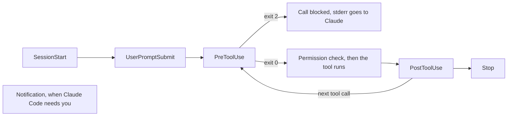

# Enforce a rule with a hook

<sub>**Intermediate** · Lesson 5 of 8 · about 20 minutes · Needs: [Permissions, settings scopes and the sandbox](04-permissions-and-sandbox.md) · Verified against Claude Code v2.1.285 (stable) on 2026-10-06</sub>

## Goal

By the end of this lesson you can add a hook that enforces a rule every time Claude edits a file, and show it firing.

## You need

- The repository from [lesson 4](04-permissions-and-sandbox.md), with its `.claude/settings.json`, and your copy of the practice template with Node.js LTS: the check runs from the copy.
- `jq`, which the hook scripts use, and `python3`, which `format-after-edit.sh` uses.
- Usage: light.

## The idea

A `CLAUDE.md` rule is advice that Claude can miss. A [hook](https://code.claude.com/docs/en/hooks-guide) is your own command that Claude Code runs at a fixed point in a session, every time, whatever Claude decides. Claude Code passes the hook JSON about the event on stdin. A `PreToolUse` hook runs before a tool call; if it exits with code 2, the call is blocked, and what it printed to stderr goes to Claude as the reason ([Hooks reference](https://code.claude.com/docs/en/hooks#exit-code-2-behavior-per-event), [Block edits to protected files](https://code.claude.com/docs/en/hooks-guide#block-edits-to-protected-files)).

These are the events this lesson uses, and where they fall in a turn:



A matcher picks the tools a hook watches: `Edit|Write` runs it for those two tools only ([Filter hooks with matchers](https://code.claude.com/docs/en/hooks-guide#filter-hooks-with-matchers)). `PreToolUse` hooks fire before the permission-mode check, so a block holds in every mode ([Hooks and permission modes](https://code.claude.com/docs/en/hooks-guide#hooks-and-permission-modes)).

## Worked example

1. In your repository, download two of this guide's [example hooks](../../examples/intermediate/05-hooks/README.md) and make them executable. Read them before you use them:

   ```bash
   mkdir -p .claude/hooks
   for f in protect-files format-after-edit; do
     curl -fsSL "https://raw.githubusercontent.com/wesammustafa/Claude-Code-Everything-You-Need-to-Know/main/examples/intermediate/05-hooks/dot-claude/hooks/$f.sh" -o ".claude/hooks/$f.sh"
   done
   chmod +x .claude/hooks/*.sh
   ```

   `protect-files.sh` is the hooks guide's script for blocking edits to `.env`, `package-lock.json` and `.git/`. `format-after-edit.sh` removes trailing spaces from a source file after Claude edits it.
2. Register them in `.claude/settings.json`, beside the `permissions` block from lesson 4:

   ```json
   "hooks": {
     "PreToolUse": [
       { "matcher": "Edit|Write", "hooks": [ { "type": "command", "command": "${CLAUDE_PROJECT_DIR}/.claude/hooks/protect-files.sh", "args": [] } ] }
     ],
     "PostToolUse": [
       { "matcher": "Edit|Write", "hooks": [ { "type": "command", "command": "${CLAUDE_PROJECT_DIR}/.claude/hooks/format-after-edit.sh", "args": [] } ] }
     ]
   }
   ```

   With `"args": []`, Claude Code runs the script directly, without a shell, so the path needs no quotes ([Exec form and shell form](https://code.claude.com/docs/en/hooks#exec-form-and-shell-form)).
3. Test the hook without Claude, by piping in the JSON an Edit call would send. Edit and Write always send an absolute path ([PreToolUse input](https://code.claude.com/docs/en/hooks#pretooluse-input)), so build it from `$PWD`:

   ```bash
   echo "{\"tool_input\":{\"file_path\":\"$PWD/package-lock.json\"}}" | .claude/hooks/protect-files.sh; echo "exit $?"
   ```

   It prints a `Blocked:` line and `exit 2`.
4. Start `claude` and run `/hooks`: your hooks appear under `PreToolUse` and `PostToolUse` ([Debug your configuration](https://code.claude.com/docs/en/debug-your-config#check-hooks)).
5. Ask for an edit the hook protects. In the practice template, `package-lock.json` exists; in your repository, name a protected file that it has:

   ```text
   Use your Edit tool, not a shell command, to change the top-level version in package-lock.json to 1.0.1.
   ```

   The Edit is blocked: Claude Code passes your script's `Blocked:` message to Claude as feedback ([Exit code output](https://code.claude.com/docs/en/hooks#exit-code-output)). Ask for the Edit tool by name here: Claude can also edit a file through a shell command, which an `Edit|Write` hook doesn't see.

## Your turn

The guide's script matches substrings. `*".env"*` also blocks `.env.example`, which teams commit on purpose, and a file such as `src/config.envelope.ts`; and nothing blocks a `secrets/` folder. Replace `.claude/hooks/protect-files.sh` with this skeleton, which keeps the guide's `package-lock.json` and `.git/` blocks, and finish it:

```bash
#!/bin/bash
INPUT=$(cat)
FILE_PATH=$(echo "$INPUT" | jq -r '.tool_input.file_path // empty')
FILE_PATH="${FILE_PATH//\\//}"
NAME=$(basename "$FILE_PATH")

case "/$FILE_PATH" in
  */package-lock.json | */.git/*)
    echo "Blocked: $FILE_PATH is protected" >&2
    exit 2
    ;;
esac

# TODO: block a file named .env, or .env. followed by anything except example
# TODO: block any file inside a secrets/ folder

exit 0
```

1. Each block prints a `Blocked:` reason to stderr and exits with 2; everything else exits with 0.
2. Run the Check's test table until every row gives its expected exit code.
3. In a session, ask Claude to use its Write tool to create `secrets/test.key`. Your hook blocks it.
4. Commit the script and `.claude/settings.json`. Keep the script executable: `git ls-files -s .claude/hooks/protect-files.sh` starts with `100755`.

## Check

You are done when all of these are true:

- [ ] Each path gives its expected exit code: 2 for `.env`, `config/.env.local`, `secrets/api.key`, `package-lock.json` and `.git/config`; 0 for `.env.example`, `src/config.envelope.ts` and `src/app.js`. Run this from your repository's root:

  ```bash
  for p in .env config/.env.local .env.example secrets/api.key src/config.envelope.ts src/app.js package-lock.json .git/config; do
    printf '%s ' "$p"; echo "{\"tool_input\":{\"file_path\":\"$PWD/$p\"}}" | .claude/hooks/protect-files.sh 2>/dev/null; echo $?
  done
  ```

- [ ] The script is committed and executable, and the committed `.claude/settings.json` runs it as a `PreToolUse` hook for `Edit|Write`: `git show HEAD:.claude/settings.json | jq .hooks.PreToolUse` shows it.
- [ ] Self-check (not tested): Claude's attempt to create `secrets/test.key` was blocked with your `Blocked:` message.

Run `npm run check -- i-5 --dir <your repo>` from your practice copy, or `npm run check -- i-5` in the copy itself.

If a row is wrong, test that path alone and print the name the script sees: `basename` of `.env.local` is `.env.local`, so a `case` pattern `.env.*` matches it. The check runs the committed script, so commit each fix before you run it. If the second item fails on the file mode, run `chmod +x .claude/hooks/protect-files.sh`, then `git add` it and commit again.

## Watch out

- Hooks run with your user's rights: in an interactive session once you trust the folder, and in a `claude -p` run without asking ([Workspace trust](https://code.claude.com/docs/en/hooks#workspace-trust)). Read a repository's hooks before you trust it or script Claude Code in it.
- An `Edit|Write` hook doesn't see shell commands: `echo X >> .env` goes through Bash. Lesson 4's `Read` rules stop commands such as `cat .env` from reading those files, but a write such as that `>>` is checked against `Edit` rules, which lesson 4 doesn't add ([Redirections](https://code.claude.com/docs/en/permissions#redirections)). For a hook that sees every change, the hooks guide adds a `Bash|PowerShell` matcher or a `Stop` hook that scans the working tree ([Filter hooks with matchers](https://code.claude.com/docs/en/hooks-guide#filter-hooks-with-matchers)).
- A Notification hook, such as the example [`desktop-notify.sh`](../../examples/intermediate/05-hooks/dot-claude/hooks/desktop-notify.sh), is about you, not the project: the hooks guide registers its notification examples in `~/.claude/settings.json`. Do the same, with the path to wherever you keep the script.

## Go further

- [Automate actions with hooks](https://code.claude.com/docs/en/hooks-guide): more ready-made hooks, including notifications and re-injecting context after compaction.
- [Hooks reference](https://code.claude.com/docs/en/hooks): every event, its input and its output.
- [Debug your configuration](https://code.claude.com/docs/en/debug-your-config#check-hooks): what to check when a hook doesn't fire.

---

<sub>Sources: [Automate actions with hooks](https://code.claude.com/docs/en/hooks-guide) · [Hooks reference](https://code.claude.com/docs/en/hooks) · [Configure permissions](https://code.claude.com/docs/en/permissions) · [Debug your configuration](https://code.claude.com/docs/en/debug-your-config)</sub>

<sub>← [Permissions, settings scopes and the sandbox](04-permissions-and-sandbox.md) · [Intermediate index](README.md) · [Delegate to a custom subagent](06-subagents.md) → · Topic: [Hooks](../topics/hooks.md) · [Stuck on this lesson?](https://github.com/wesammustafa/Claude-Code-Everything-You-Need-to-Know/issues/new?template=lesson-feedback.yml&lesson=i-5)</sub>
