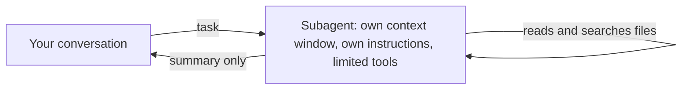

# Delegate to a custom subagent

<sub>**Intermediate** · Lesson 6 of 8 · about 20 minutes · Needs: [Permissions, settings scopes and the sandbox](04-permissions-and-sandbox.md) · Verified against Claude Code v2.1.285 (stable) on 2026-10-06</sub>

## Goal

By the end of this lesson you can write a subagent that has only the tools its task needs, and delegate work to it.

## You need

- One of your own repositories, and your copy of the practice template with Node.js LTS: the check runs from the copy. To practice in the template copy instead, use it for both.
- `jq`, for the delegation log in Your turn.
- Usage: light to moderate. Each delegation starts a second context window.

## The idea

A [subagent](https://code.claude.com/docs/en/sub-agents) is a separate Claude that your session hands a task to. It works in its own context window, with its own instructions and only the tools you give it, and returns a summary. Its file reads and search results stay out of your conversation:



A project subagent is a Markdown file in `.claude/agents/`: frontmatter with a `name` and a `description` (both required), an optional `tools` list, then the instructions it works from. Claude reads the description to decide when to delegate; you can also name the subagent in your request.

Delegate a task whose output you don't need in full, or that should run with restricted tools. Keep it in the main conversation when it needs back-and-forth, or when it's a quick, targeted change ([Choose between subagents and main conversation](https://code.claude.com/docs/en/sub-agents#choose-between-subagents-and-main-conversation)).

## Worked example

1. In your repository, download this guide's example [`code-reviewer`](../../examples/intermediate/06-subagents/dot-claude/agents/code-reviewer.md) and read it:

   ```bash
   mkdir -p .claude/agents
   curl -fsSL https://raw.githubusercontent.com/wesammustafa/Claude-Code-Everything-You-Need-to-Know/main/examples/intermediate/06-subagents/dot-claude/agents/code-reviewer.md -o .claude/agents/code-reviewer.md
   ```

   Its frontmatter limits it to three tools, so it can read and search files but can't edit them or run commands:

   ```yaml
   name: code-reviewer
   tools: Read, Grep, Glob
   ```

2. Start `claude`. If a session was already running when you created `.claude/agents/`, restart it: Claude Code watches only the agent folders that existed when the session started ([Write subagent files](https://code.claude.com/docs/en/sub-agents#write-subagent-files)).
3. Make a small change in a source file, then ask:

   ```text
   Use the code-reviewer agent to review my uncommitted changes.
   ```

   The transcript shows a row such as `code-reviewer(Review uncommitted changes)` while it works. The reviewer can't run `git diff`, so it starts from the task message your session writes for it and a git status snapshot ([What loads at startup](https://code.claude.com/docs/en/sub-agents#what-loads-at-startup)); then you get its findings as a summary, grouped by severity. Your wording will differ.

## Your turn

Finish a read-only subagent that finds code no test calls, then delegate to it.

1. Save this as `.claude/agents/test-gaps.md`, and replace both `TODO`s. Give it only read-only tools:

   ```markdown
   ---
   name: test-gaps
   description: TODO
   tools: TODO
   ---

   You find code that no test exercises. You never change files.

   1. List the functions each source file exports.
   2. For each one, search the test files for a call to it.
   3. Report the functions that no test calls, grouped by file, with one line on what a test for each should check. If every function has a test, say so.
   ```

2. Commit it.
3. Save this delegation log to `.practice/i-6-hook.json`. It is a [`SubagentStart` hook](https://code.claude.com/docs/en/hooks#subagentstart) that appends the name of each subagent Claude starts to `.practice/i-6-agents.txt`, and logs nothing else:

   ```json
   {
     "hooks": {
       "SubagentStart": [
         { "hooks": [ { "type": "command", "command": "jq -r '.agent_type' >> \"$CLAUDE_PROJECT_DIR/.practice/i-6-agents.txt\"" } ] }
       ]
     }
   }
   ```

4. Start `claude --settings .practice/i-6-hook.json` and ask `Use the test-gaps agent to list the functions no test calls.`

## Check

You are done when all of these are true:

- [ ] The committed subagent has its name and a description of when to use it: `git show HEAD:.claude/agents/test-gaps.md | head -5`.
- [ ] Its tools are read-only: the `tools` line names tools such as `Read`, `Grep` and `Glob`, and no tool that edits files or runs commands, such as `Edit`, `Write` or `Bash`.
- [ ] Claude delegated to it: `grep -x test-gaps .practice/i-6-agents.txt` prints `test-gaps`.
- [ ] Self-check (not tested): the subagent's file reads stayed out of your conversation, and only its summary came back.

Run `npm run check -- i-6 --dir <your repo>` from your practice copy, or `npm run check -- i-6` in the copy itself.

If the first item fails, check the frontmatter: Claude Code skips an agent file without a `name`, and one with a `name` but no `description`. If the tools item fails, remove each tool that can change files or run commands; without a `tools` line, a subagent gets every tool. If the log has no `test-gaps` line, start the session with the hook file and name the subagent in your request.

## Watch out

- A subagent that lists `Bash` can still change files through shell commands, such as a `sed` edit or a [`> file` redirect](https://code.claude.com/docs/en/permissions#redirections), even without `Edit` or `Write`. Leave `Bash` out, and let your session pass it what a command would have shown.
- On macOS, Linux and WSL, where Glob and Grep are absent by default, a subagent whose `tools` list names `Glob` or `Grep` and leaves out `Bash` gets the ones it names ([Glob tool behavior](https://code.claude.com/docs/en/tools-reference#glob-tool-behavior)).
- A custom subagent reads your `CLAUDE.md` as the main conversation does, but the built-in Explore and Plan subagents skip it: restate a rule in your request when Claude hands them work ([Check common causes](https://code.claude.com/docs/en/debug-your-config#check-common-causes)).

## Go further

- [Introduction to subagents](https://academy.claude.com/courses/introduction-to-subagents): Claude Academy's course on designing and using subagents.
- [How and when to use subagents in Claude Code](https://claude.com/blog/subagents-in-claude-code): Anthropic on when to delegate and when to stay in the main session.
- [Create custom subagents](https://code.claude.com/docs/en/sub-agents): every frontmatter field, background subagents and resuming one.

---

<sub>Sources: [Create custom subagents](https://code.claude.com/docs/en/sub-agents) · [Hooks reference](https://code.claude.com/docs/en/hooks) · [Tools reference](https://code.claude.com/docs/en/tools-reference) · [Configure permissions](https://code.claude.com/docs/en/permissions) · [Debug your configuration](https://code.claude.com/docs/en/debug-your-config)</sub>

<sub>← [Enforce a rule with a hook](05-hooks.md) · [Intermediate index](README.md) · [Connect a tool with MCP](07-mcp.md) → · Topic: [Subagents and parallel work](../topics/subagents-and-parallel-work.md) · [Stuck on this lesson?](https://github.com/wesammustafa/Claude-Code-Everything-You-Need-to-Know/issues/new?template=lesson-feedback.yml&lesson=i-6)</sub>
