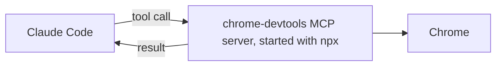

# Connect a tool with MCP

<sub>**Intermediate** · Lesson 7 of 8 · about 20 minutes · Needs: [Permissions, settings scopes and the sandbox](04-permissions-and-sandbox.md) · Verified against Claude Code v2.1.285 (stable) on 2026-10-06</sub>

## Goal

By the end of this lesson you can connect an MCP server for yourself, then share it with everyone in a project at project scope, pinned to one version.

## You need

- One of your own repositories, and your copy of the practice template with Node.js LTS: the check runs from the copy. To practice in the template copy instead, use it for both. Set up the repository's `.practice/` folder as [Beginner lesson 1](../beginner/01-install-and-look-around.md#you-need) describes, if you haven't yet.
- Chrome, and npm, which comes with Node.js: the server runs through `npx` ([upstream requirements](https://github.com/ChromeDevTools/chrome-devtools-mcp/blob/chrome-devtools-mcp-v1.10.1/README.md#requirements)).
- Usage: light.

## The idea

[MCP](https://code.claude.com/docs/en/mcp) (the Model Context Protocol) lets Claude Code use tools that another program provides: an MCP server. This lesson's server is [Chrome DevTools MCP](https://github.com/ChromeDevTools/chrome-devtools-mcp) (Vendor: Google), which runs on your machine and gives Claude tools to open pages in Chrome, read the console and take screenshots:



Where you add a server decides who gets it ([MCP installation scopes](https://code.claude.com/docs/en/mcp#mcp-installation-scopes)):

| Scope | Who gets it | Stored in |
|---|---|---|
| Local, the default | You, in this project | `~/.claude.json` |
| Project | Everyone who works in the project | `.mcp.json` at the project root, committed |
| User | You, in every project | `~/.claude.json` |

In an interactive session, Claude Code asks you to approve a project's servers before it uses them.

> [!WARNING]
> Data that leaves your machine. By default, Chrome DevTools MCP sends usage statistics to Google, may send the URLs of performance traces to Google's CrUX API, and checks npm for updates ([upstream README](https://github.com/ChromeDevTools/chrome-devtools-mcp/blob/chrome-devtools-mcp-v1.10.1/README.md)). This lesson always runs it with all three turned off. The pages Claude opens still load from the web, and the server shows Claude everything in that browser.

## Worked example

1. Save a page to look at, in your repository:

   ```bash
   cat > .practice/demo.html <<'EOF'
   <!doctype html>
   <title>Linkcheck demo</title>
   <h1>Linkcheck demo</h1>
   <script>console.warn('demo warning from the page');</script>
   EOF
   ```

2. Add the server at local scope, for yourself. The version is pinned, `--isolated` gives the browser a temporary profile, and the other two flags and the variable turn the data flows off ([configuration](https://github.com/ChromeDevTools/chrome-devtools-mcp/blob/chrome-devtools-mcp-v1.10.1/docs/configuration.md)). Everything after `--` is the server's own command:

   ```bash
   claude mcp add --env CHROME_DEVTOOLS_MCP_NO_UPDATE_CHECKS=1 --transport stdio chrome-devtools -- npx -y chrome-devtools-mcp@1.10.1 --isolated --no-usage-statistics --no-performance-crux
   ```

3. Run `claude mcp get chrome-devtools`. It shows which scope holds the server, local here, and the server's status ([Find your configuration on disk](https://code.claude.com/docs/en/mcp-quickstart#find-your-configuration-on-disk)).
4. Start `claude` and run `/mcp`: `chrome-devtools` is listed with its tools. Then ask:

   ```text
   Use the chrome-devtools tools to open .practice/demo.html as a file: URL, and tell me its title and console messages.
   ```

   A Chrome window opens, and Claude reports the title, `Linkcheck demo`, and the console warning. In Manual mode, Claude Code asks for permission the first time Claude uses each tool ([Configure permissions](https://code.claude.com/docs/en/permissions#permission-modes)).

## Your turn

Share the server with your team at project scope.

1. Remove your local copy, which would otherwise take precedence over a project server of the same name: `claude mcp remove chrome-devtools -s local`.
2. Save this partial file as `.mcp.json` at the repository root, and replace each `TODO` with the values from the Worked example's command:

   ```json
   {
     "mcpServers": {
       "chrome-devtools": {
         "type": "stdio",
         "command": "npx",
         "args": ["-y", "TODO: the package at an exact version", "--isolated", "TODO: no usage statistics", "TODO: no CrUX lookups"],
         "env": { "TODO: the variable that turns off update checks": "1" }
       }
     }
   }
   ```

3. Commit `.mcp.json`.
4. Start `claude`. When it asks about the new MCP server found in this project, choose to use it. `/mcp` now shows it as connected ([Edit .mcp.json directly](https://code.claude.com/docs/en/mcp-quickstart#edit-mcp-json-directly)).
5. Ask Claude to use the chrome-devtools tools to open `.practice/demo.html` and save a screenshot of it to `.practice/i-7-page.png`.

## Check

You are done when all of these are true:

- [ ] The committed `.mcp.json` pins the package to an exact version and turns off usage statistics, CrUX lookups and update checks: `git show HEAD:.mcp.json | jq '.mcpServers["chrome-devtools"]'` shows them.
- [ ] The server saved a screenshot: `file .practice/i-7-page.png` reports PNG image data.
- [ ] Self-check (not tested): after you approved it, `/mcp` showed `chrome-devtools` as connected.

Run `npm run check -- i-7 --dir <your repo>` from your practice copy, or `npm run check -- i-7` in the copy itself.

If the first item fails, compare each argument with the Worked example's command: `@latest` isn't pinned. If there's no screenshot, run `/mcp` to see whether the server connected. If you missed the approval prompt, approve the server there; if you declined it, run `claude mcp reset-project-choices` and start `claude` again ([Project scope](https://code.claude.com/docs/en/mcp#project-scope)).

## Watch out

- A `claude -p` run loads a project's servers without asking ([Project scope](https://code.claude.com/docs/en/mcp#project-scope)). Read a repository's `.mcp.json` before you script Claude Code in it.
- To be asked about a project's servers again, run `claude mcp reset-project-choices`.

Third-party: it can run code on your machine or give Claude new tools. Review it before installing; this guide does not audit it.

Listings checked against the listing bar on 2026-10-06.

## Go further

- [Connect to MCP servers](https://code.claude.com/docs/en/mcp-quickstart): adding remote servers, signing in to them, and other ways to add one.
- [The MCP Registry](https://registry.modelcontextprotocol.io): the MCP project's list of public servers, which it labels "preview" ([About](https://modelcontextprotocol.io/registry/about)).
- [What is the Model Context Protocol (MCP)?](https://modelcontextprotocol.io/docs/getting-started/intro): the protocol itself.

---

<sub>Sources: [Connect Claude Code to tools via MCP](https://code.claude.com/docs/en/mcp) · [Connect to MCP servers](https://code.claude.com/docs/en/mcp-quickstart) · [Configure permissions](https://code.claude.com/docs/en/permissions) · [Chrome DevTools MCP README](https://github.com/ChromeDevTools/chrome-devtools-mcp/blob/chrome-devtools-mcp-v1.10.1/README.md) · [Chrome DevTools MCP configuration](https://github.com/ChromeDevTools/chrome-devtools-mcp/blob/chrome-devtools-mcp-v1.10.1/docs/configuration.md) · [The MCP Registry](https://modelcontextprotocol.io/registry/about)</sub>

<sub>← [Delegate to a custom subagent](06-subagents.md) · [Intermediate index](README.md) · [Install and manage plugins](08-plugins.md) → · Topic: [MCP](../topics/mcp.md) · [Stuck on this lesson?](https://github.com/wesammustafa/Claude-Code-Everything-You-Need-to-Know/issues/new?template=lesson-feedback.yml&lesson=i-7)</sub>
